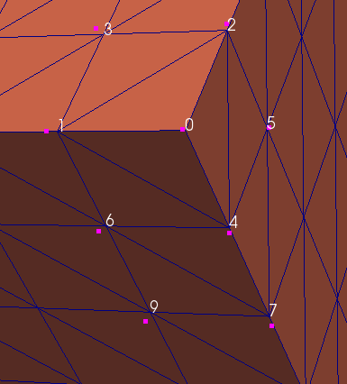

Write Triangle Geometry {#writetrianglegeometry}
======

## Group (Subgroup) ##
IO (Output)

## Description ##

This filter creates 2 files from the Vertices and Triangles from a Triangle Geometry. The basic form of the files is simple ASCII where the *vertices* are a "Shared Vertex List" and the *triangles* consist of 3 values where each value is the index into the **vertex** list.

**Example Nodes File**

	# All lines starting with '#' are comments
	# DREAM.3D Nodes file
	# DREAM.3D Version 6.1.92.0613671
	# Node Data is X Y Z space delimited.
	Node Count: 57920
	 0.00000  0.00000  0.00000
	 0.00000  0.50000  0.00000
	 0.00000  0.00000  0.50000
	 0.00000  0.50000  0.50000
	 …………..

**Example Triangles File**

	# All lines starting with '#' are comments
	# DREAM.3D Triangle file
	# DREAM.3D Version 6.1.92.0613671
	# Each Triangle consists of 3 Node Ids.
	# NODE IDs START AT 0.
	Node Count: 57920
	Max Node Id: 57919
	Triangle Count: 120774
	0 1 2
	1 3 2
	0 2 4
	4 2 5
	0 4 1
	4 6 1
	4 5 7

## Parameters ##

| Name | Type |
|----------|--------|
| Output Nodes File | Output File Path |
| Output Triangles File | Output File Path |

## Required Geometry ##

Triangle

## Required Objects ##

| Kind | Default Name | Type | Component Dimensions | Description |
|------|--------------|------|----------------------|-------------|
| **Data Container** | None | N/A | N/A | **Data Container** in which to place the created **Triangle Geometry** |

## Created Objects ##

None

## License & Copyright ##

Please see the description file distributed with this **Plugin**

## DREAM.3D Mailing Lists ##

If you need more help with a **Filter**, please consider asking your question on the [DREAM.3D Users Google group!](https://groups.google.com/forum/?hl=en#!forum/dream3d-users)

