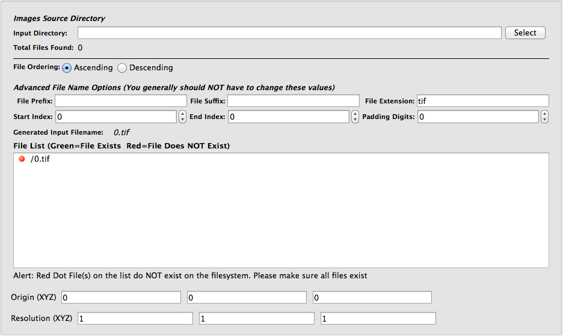
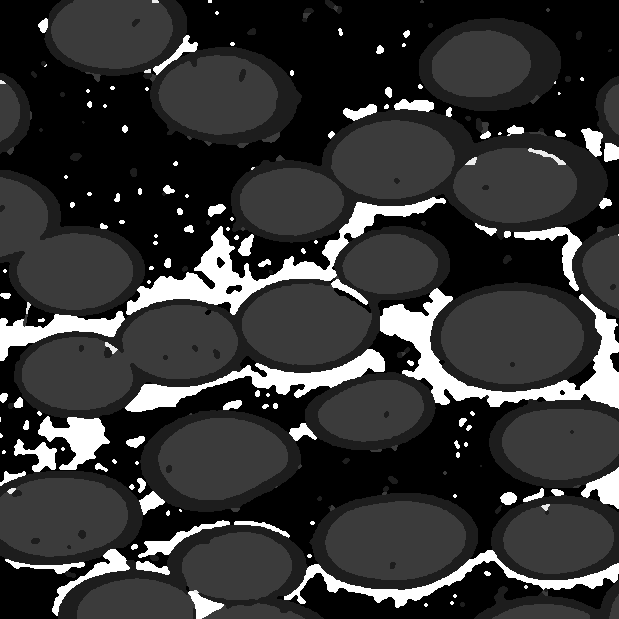

Import Images (3D Stack) {#importimagestack}
=============

## Group (Subgroup) ##
IO (Input)

## Description ##
This Filter is used to import a stack of 2D images that represent a 3D volume.  This Filter makes use of Qt's [QImage](http://doc.qt.io/qt-4.8/qimage.html) class to perform the import, although not all [QImage formats](http://doc.qt.io/qt-4.8/qimage.html#Format-enum) are currently supported by this filter. Currently, support only exists for 8 bit grayscale, 32 bit RGB, and 32 bit ARGB images. Note that due to limitations of the Xdmf wrapper, 4 component ARGB images cannot be visualized using ParaView. The only current way to solve this issue is to import the image data and then apply the [Flatten Image](flattenimage.html) Filter, which will convert the color data to gray scale data. The image can then be visualized in ParaView using the Xdmf wrapper.

## Importing a Stack of Images ##
This Filter will import a directory of sequentially numbered image files into the DREAM.3D data structure, creating a **Data Container**, **Cell Attribute Matrix**, and **Attribute Array** in the process, which the user may name. The user selects the directory that contains all the files to be imported then uses the additional input widgets on the Filter interface (_File Prefix_, _File Suffix_, _File Extension_, and _Padding Digits_) to make adjustments to the generated file name until the correct number of files is found. The user may also select starting and ending indices to import. The user interface indicates through red and green icons if an expected file exists on the file system. This Filter may also be used to import single images in addition to stacks of images.  The user may also enter the origin and resolution of the imported images, if known.

-----

@image latex ImportImageStackGUI.png "Import Image Stack User Interface" width=6in

-----

DREAM.3D contains numerous tools to modify, analyze and segment generic image data.  If your images are already pre-processed so that they are segmented into specific regions, DREAM.3D may also be able to work with the image data and produce meaningful results. Three categories of images that DREAM.3D can handle include the following:

-----

## Category 1 Image ##

The regions of the image that represent an **Ensemble** or **Feature** each have a unique identifier such as a grayscale value or unique RGB value.

@image latex Type1.png "Category 1 Image" width=6in

-----

## Category 2 Image ##

There are regions in the image that represent **Features**, where each region has a unique identifier but there are multiple regions with the same identifier.

@image latex Type2.png "Category 2 Image" width=6in

-----

## Category 3 Image ##

Each **Feature** is traced out via another pixel identifier so that **Feature** boundaries are "black" and each **Feature** is "white". This type of image is commonly referred to as a *binary* image.

@image latex Type3.png "Category 3 Image" width=6in

-----

Note that the above categories represent a small subset of the kinds of images DREAM.3D can process.  In general, any kind of multi-dimensional data can be stored and analyzed by DREAM.3D.

## Parameters ##
See Description

## Required Geometry ##
Not Applicable

## Required Arrays ##
None

## Created Arrays ##
| Type | Default Name | Type | Component Dimensions | Description |
|------|--------------|------|----------------------|-------------|
| Cell  | ImageData | UInt8 | (n) | **Attribute Array** for the imported image data. The dimensionality of the array depends on the kind of image read: (1) for grayscale, (3) for RGB, and (4) for ARGB |

## License & Copyright ##

Please see the description file distributed with this plugin.

## DREAM3D Mailing Lists ##

If you need more help with a filter, please consider asking your question on the DREAM3D Users mailing list:
https://groups.google.com/forum/?hl=en#!forum/dream3d-users

