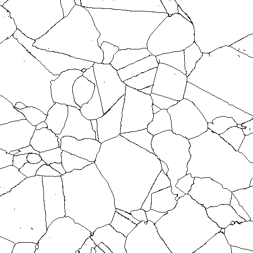

Import Image Stack Filter {#importvectorimagestack}
=============

## Group (Subgroup) ##
IO (Input)

## Description ##
Images that are imported into DREAM3D should probably be segmented using a preprocessing tool as there are currently no effective tools to do the segmentation in DREAM3D itself. If your images are already preprocessed so that they are segmented into specific regions DREAM3D may be able to work with the image data and give you meaningful results. There are 3 categories of images that DREAM3D can handle.

----------

## Type 1 Image

The regions of the image that represent a phase or grain each have a unique identifier such as a gray scale value or unique RGB value.

@image latex Type1.png "Type 1 Image" width=5in

-----

## Type 2 Image ##

There are regions that represent grains where each region has a unique identifier but there are multiple regions with the same identifier.

@image latex Type2.png "Type 2 Image" width=5in

-----

## Type 3 Image ##

Each Grain is traced out via a another pixel identifier so that grain boundaries are "black" and each grain is "white".

@image latex Type3.png "Type 3 Image" width=5in

-----

## Notes
When importing color images they will be imported as RGBA, or color with Alpha values. Due to some limitations of the XDMF wrapper the 4 component arrays will only show as 3 component arrays in the XDMF description which will mess up the rendering in ParaView. The only current way to solve this issue is to import the image data and then follow that with the [Flatten Image](flattenimage.html) filter which will convert the color data to gray scale data. Then writing out the .dream3d file with the xdmf wrapper will allow the user to properly see their data.

## Parameters ##

| Name             |  Type  |
|------------------|--------|
| Feature Array Name | String |

## Required DataContainers ##

Voxel

## Required Objects ##

None

## Created Objects ##

| Type | Default Array Name | Description | Comment |
|------|--------------------|-------------|---------|
| Int  | User Defined       | ....        | other   |

## Authors ##

**Contact Info** dream3d@bluequartz.net

**Version** 1.0.0

**License**  See the License.txt file that came with DREAM3D.

## License & Copyright ##

Please see the description file distributed with this **Plugin**

## DREAM.3D Mailing Lists ##

If you need more help with a **Filter**, please consider asking your question on the [DREAM.3D Users Google group!](https://groups.google.com/forum/?hl=en#!forum/dream3d-users)

