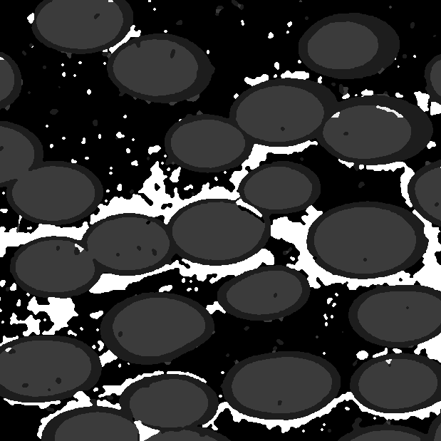

Import Image Stack Filter {#importimagestack}
======

## Group (Subgroup) ##
Image Import Filters (Input)

## Description ##
Images that are imported into DREAM3D should probably be segmented using a preprocessing tool as there are currently no effective tools to do the segmentation in DREAM3D itself. If your images are already preprocessed so that they are segmented into specific regions DREAM3D may be able to work with the image data and give you meaningful results. There are probably 3 categories of images that DREAM3D can handle with some modifications to current filters.

+  The regions of the image that represent a phase or grain each have a unique identifier such as a gray scale value or unique RGB value.
+  There are regions that represent grains where each region has a unique identifier but there are multiple regions with the same identifier.
+  Each Grain is traced out via a another pixel identifier so that grain boundaries are "black" and each grain is "white".

DREAM3D will need to implement filters with algorithms that can work with these cases and bring a consistent grain numbering to the imported volume which is important for things like the statistics and surface meshing routines.

-----

-----

-----

-----

## Parameters ##
| Name             | Type |
|------------------|------|
| Field Array Name | String |

## Required DataContainers ##
Voxel

## Required Arrays ##
None

## Created Arrays ##

| Type | Default Array Name | Description | Comment |
|------|--------------------|-------------|---------|
| Int  | User Defined       | ....        | other   |

## Authors ##

**Copyright** 2012 Michael A. Groeber (AFRL),2012 Michael A. Jackson (BlueQuartz Software)

**Contact Info** dream3d@bluequartz.net

**Version** 1.0.0

**License**  See the License.txt file that came with DREAM3D.

