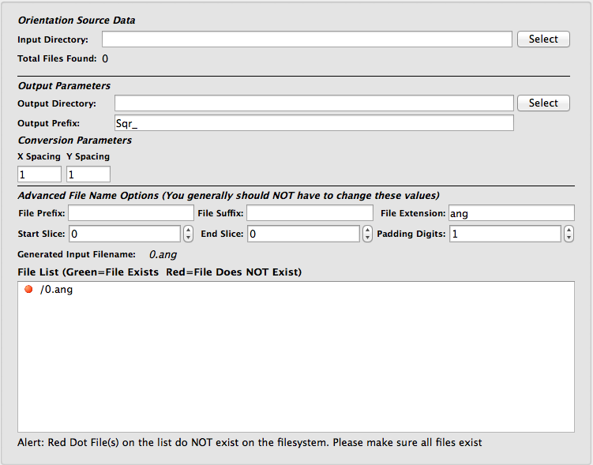

Convert Hexagonal Grid Data to Square Grid Data (TSL - .ang) {#converthexgridtosquaregrid}
=============

## Group (Subgroup) ##
Sampling (Resolution)

## Description ##
This **Filter** will convert TSL .ang files on hexagonal grids to TSL .ang files on square grids by means of interpolation between points. Note that the resulting square grid .ang files may have more or less rows of data and that some data may be interpolated based on its neighbor data.  By default, the spacing of the square grid will be the spacing between columns in the hexagonal grid.

This **Filter** is useful since most DREAM.3D routines for analyzing Ebsd data require a square grid.  After using this **Filter** to bulk convert the TSL .ang files to square grids, it is suggested to use the [Import Orientation File(s) to H5Ebsd](EbsdToH5Ebsd.html "") **Filter** to convert the square grid .ang files to the H5Ebsd format. The user can then use the [Read H5Ebsd File](ReadH5Ebsd.html "") **Filter** to import the H5Ebsd file into DREAM.3D for analysis.  

-----

-----

The use of this **Filter** is similar to the use of the [Import Orientation File(s) to H5Ebsd](EbsdToH5Ebsd.html "") **Filter**.  Please consult that **Filter's** documentation for a detailed description of the various user interface elements.  Note that unlike the [Import Orientation File(s) to H5Ebsd](EbsdToH5Ebsd.html "") **Filter**, this **Filter** does not require either the _Stacking Order_ or the _Reference Frame_ to be modified.

## Parameters ##
See Description

## Required Geometry ##
Not Applicable

## Required Objects ##
None

## Created Objects ##
None

## License & Copyright ##

Please see the description file distributed with this **Plugin**

## DREAM.3D Mailing Lists ##

If you need more help with a **Filter**, please consider asking your question on the [DREAM.3D Users Google group!](https://groups.google.com/forum/?hl=en#!forum/dream3d-users)

