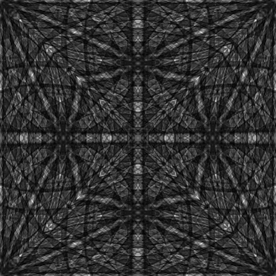
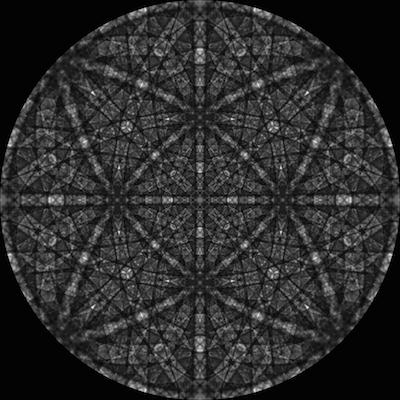

Create Lambert Sphere from MasterPattern{#createlambertsphere}
=============

## Group (Subgroup) ##

Surface Meshing (Processing)

## Description ##

This filter will generate a 3D Unit sphere from an EMsoft Master Pattern image where the master pattern is represented in a Lambert Square. In praticality any image can be used as long as the image is Square and a single plane.

The algorithm uses equations (8) & (9) from the paper D. Rosca, "New uniform grids on the sphere" Astronomy & Astrophysics, 520, A63 (2010) [http://www.aanda.org/articles/aa/pdf/2010/12/aa15278-10.pdf](http://www.aanda.org/articles/aa/pdf/2010/12/aa15278-10.pdf)

The algorithm proceeds to create a vertex at the corner of every pixel in the image and a quad cell type for every pixel. The original pixel grayscale value is then assigned to that quad. The resulting Quad mesh is an equal area mesh.

## Parameters ##

| Name       | Type | Description |
|------------|------| ------------|
| Hemisphere | int | 0=Northern, 1=Southern |

## Required Geometry ##

Image Geometry

## Required Objects ##

| Kind | Default Name | Type | Component Dimensions | Description |
|------|--------------|------|----------------------|-------------|
| Master Pattern  | MasterPattern | UInt8 | 1 | Gray Scale image of the master pattern |

## Created Objects ##

| Kind | Default Name | Type | Component Dimensions | Description |
|------|--------------|------|----------------------|-------------|
| Output Quad Geometry  | Quad Geometry |  |  | Parent Geomerty |
| Vertex Array  | VertexData | SharedVertexList  | 3 | List of all vetex coords |
| Quad Array  | FaceData | Shared Index List | 4 | List of Quads  |
| Master Pattern Quad Values  | Face Attribute Data | UInt8 Array | 1 | Transfer of image data to Quad geometry  |

## Created Geometry ##

QuadGeometry

## License & Copyright ##

Please see the description file distributed with this **Plugin**

## DREAM.3D Mailing Lists ##

If you need more help with a **Filter**, please consider asking your question on the [DREAM.3D Users Google group!](https://groups.google.com/forum/?hl=en#!forum/dream3d-users)

