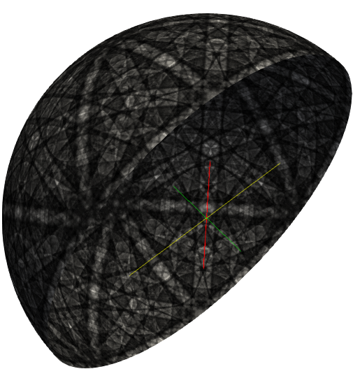

# Create Sphere (Lambert Projection Technique) #

## Group (Subgroup) ##

Surface Meshing (Processing)

## Description ##

This filter will generate a 3D Unit sphere using a techinque involving a transformation from a Lambert Square to a Unit Sphere.

The algorithm uses equations (8) & (9) from the paper D. Rosca, "New uniform grids on the sphere" Astronomy & Astrophysics, 520, A63 (2010) [http://www.aanda.org/articles/aa/pdf/2010/12/aa15278-10.pdf](http://www.aanda.org/articles/aa/pdf/2010/12/aa15278-10.pdf)

The algorithm proceeds to create a vertex at the corner of every pixel in the image and a quad cell type for every pixel. The resulting Quad mesh is an equal area mesh.

## Parameters ##

| Name       | Type | Description |
|------------|------| ------------|
| Hemisphere | int | 0=Northern, 1=Southern |
| Create Vertex Geometry | Bool | Creates Vertex Geometry |
| Create Edge Geometry | Bool | Creates Edge Geometry |
| Create Triangle Geometry | Bool | Creates Triangle Geometry |
| Create Quad Geometry | Bool | Creates Quad Geometry |
| Map Image Data | Bool | Assigns values from the array to the elements of the new geometries |

## Required Geometry ##

None

## Required Objects ##

| Kind | Default Name | Type | Component Dimensions | Description |
|------|--------------|------|----------------------|-------------|
| Data Array | Image Data | UInt8 | 1 | Gray Scale image.|

### Generating a GrayScale Image ###

First use the **Color Table** filter to generate a color table. Use the "Gray Scale" preset for this. The new array will actually be an RGB or 3 Component UInt8 array. You can either use the **Extract Component as Array** filter or the **Color to GrayScale** filter to create the final gray scale image.

## Created Objects ##

| Kind | Default Name | Type | Component Dimensions | Description |
|------|--------------|------|----------------------|-------------|
| Output Vertex Geometry  | Vertex Geometry |  |  | Parent Geomerty |
| Output Edge Geometry  | Edge Geometry |  |  | Parent Geomerty |
| Output Triangle Geometry  | Triangle Geometry |  |  | Parent Geomerty |
| Output Quad Geometry  | Quad Geometry |  |  | Parent Geomerty |

## Created Geometry ##

Vertex, Edge, Triangle, QuadGeometry

## Example Pipelines ##

+ Create Lambert Sphere Surface

## License & Copyright ##

Please see the description file distributed with this **Plugin**

## DREAM.3D Mailing Lists ##

If you need more help with a **Filter**, please consider asking your question on the [DREAM.3D Users Google group!](https://groups.google.com/forum/?hl=en#!forum/dream3d-users)

