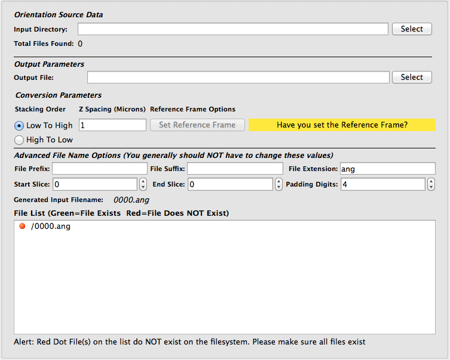
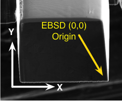
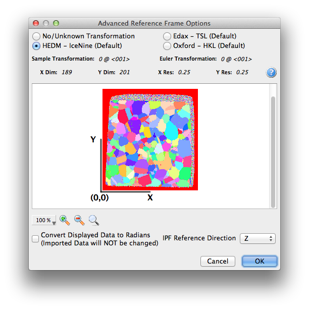
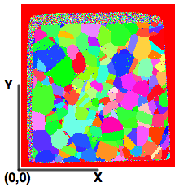

Import Orientation File(s) to H5EBSD {#ebsdtoh5ebsd}
=============

## Group (Subgroup) ##
IO (Input)

## Description ##
This **Filter** will convert orientation data obtained from Electron Backscatter Diffraction (EBSD) experiments into a single file archive based on the [HDF5](http://www.hdfgroup.org) file specification. See the **Supported File Formats** section below for information on file compatibility. This **Filter** is typically run as a single **Filter** **Pipeline** to perform the conversion. All subsequent **Pipelines** should then use the [Read H5EBSD File](readh5ebsd.html) **Filter** to import the H5EBSD file into DREAM.3D for analysis, as opposed to re-importing the raw EBSD files.  The primary purpose of this **Filter** is to import a stack of data that forms a 3D volume.  If the user wishes to import a single data file, then the **Filters** [Read EDAX EBSD Data (.ang)](ReadAngData.html ""), [Read EDAX EBSD Data (.h5)](ReadEdaxH5Data.html ""), or [Read Oxford Instr. EBSD Data (.ctf)](ReadCtfData.html "") should be used for EDAX .ang, EDAX .h5, or Oxford .ctf files, respectively.

### Converting Orientation Data to H5EBSD Archive ###
In order to work with orientation data, DREAM.3D needs to read the data from an archive file based on the [HDF5](http://www.hdfgroup.org) specification. In order to convert the data, the user will first build a single **Filter** **Pipeline** by selecting the [Import Orientation File(s) to H5EBSD](EbsdToH5Ebsd.html "") **Filter**. This **Filter** will convert a directory of sequentially numbered files into a single [HDF5](http://www.hdfgroup.org) file that retains all the meta data from the header(s) of the files. The user selects the directory that contains all the files to be imported then uses the additional input widgets on the **Filter** interface (_File Prefix_, _File Suffix_, _File Extension_, and _Padding Digits_) to make adjustments to the generated file name until the correct number of files is found. The user may also select starting and ending indices to import. The user interface indicates through red and green icons if an expected file exists on the file system and will also display a warning message at the bottom of the **Filter** interface if any of the generated file names do not appear on the file system.

### Stacking Order ###
Due to different experimental setups, the definition of the _bottom_ slice or the **Z=0** slice can be different. The user should verify that the proper button box is checked for their data set. 

+ **Low to High** This means that the file with the lowest index, closest to zero (0), will be considered the Z=0 slice.
+ **High to Low** This means that the file with the highest index, farthest from zero (0), will be considered the Z=0 slice.

### Z Resolution ###
Many serial sectioning systems are inherently a series of 2D scans stacked together to form a 3D volume of material. Therefore, the experimental systems have no knowledge of the amount of material that was removed between each slice and so the user is responsible for setting this value correctly for their data set.

-----

@image latex Images/ImportOrientationDataFilter.png "Import Orientation Files User Interface" width=6in

-----

## Orientations, Reference Frames and Coordinate Systems
DREAM.3D's origin follows the specimen's coordinate system so that the physical location of the 0 row and 0 column voxel should visually appear in the lower left corner of a computer graphics display as shown in the figure below, where the specimen coordinate system (white) overlaid with EBSD coordinate system (yellow).

-----

@image latex Images/CoordinateSystem1.png "TSL Coordinate System (Spatial)" width=6in

-----

Commercial EBSD acquisition systems do not typically follow this convention, and DREAM.3D needs input from the user so that the proper transformations to the data can be applied during subsequent analysis. Commercial EBSD software packages allow for some initial transformations of the data, in which case the DREAM.3D environment does not have any way of determining if those transformations have already occurred. During the import process the user is asked a few questions regarding the orientation of the EBSD data in relation to the specimen coordinate system.

-----

@image latex Images/EbsdToH5Ebsd_ReferenceFrameDialog.png "Advanced Reference Frame Dialog" width=6in

-----

### Setting the Spatial Reference Frame ###
The user needs to click the _Set Reference Frame_ button to set the proper reference frame for the data set which will be written to the H5EBSD file as meta data. Below are a number of examples showing the differences in the data sets due to the selection of different reference frames.

---

@image latex Images/NoUnknown_HEDM_RefFrame.png "No Transform or Unknown Manufacturer or HEDM Data" width=6in

---

@image latex Images/EDAX_HKL_RefFrame.png "TSL or HKL Transform" width=6in

---

### Preset Transformations ###
| Manufacturer | Sample Reference Transformation | Euler Transformation |  
|  ------	| ------	| ------	|  
| TSL | 180 @ <010> | 90 @ <001> |
| HKL | 180 @ <010> | 0 @ <001> |  
| HEDM | 0 @ <001> | 0 @ <001>
| No Transform | 0 @ <001> | 0 @ <001>

### Supported File Formats ###
| Manufacturer  | File Extension | Comments |  
|---------------|----------------|----------|  
| EDAX  | .ang | --|  
| Oxford Instruments | .ctf | 2D data sets store angles in degrees. 3D data sets store angles as radians. The user needs to add the appropriate filter to convert the data if necessary |  
| HEDM from APS | .mic | A .config file with the same name is needed for each .mic file |

### Completing the Conversion ###
Once all the inputs are correct the user can click the **Go** button to start the conversion. Progress will be displayed at the bottom of the DREAM3D user interface during the conversion.

## Parameters ##
See Description 

## Required Geometry ##
Not Applicable

## Required Objects ##
None

## Created Objects ##
None

## License & Copyright ##

Please see the description file distributed with this **Plugin**

## DREAM.3D Mailing Lists ##

If you need more help with a **Filter**, please consider asking your question on the [DREAM.3D Users Google group!](https://groups.google.com/forum/?hl=en#!forum/dream3d-users)

