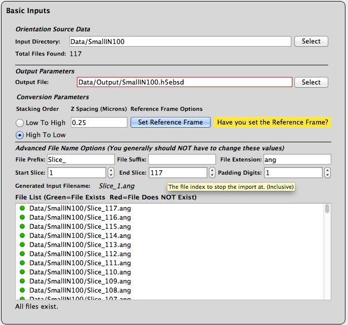
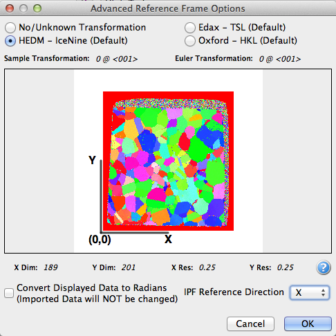
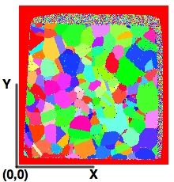

Import Orientation File(s) to H5Ebsd {#ebsdtoh5ebsd}
=============

## Group (Subgroup) ##

I/O Filters (Input)

## Description ##

This filter will convert orientation data in the form of EBSD style of data into a single file archive based on the [HDF5](http://www.hdfgroup.org) file specification. This filter is typically run as a single filter pipeline to do the conversion. All subsequent pipelines should use the [Read H5Ebsd Filter](readh5ebsd.html) as a data source instead of converting the data each time.

### Converting Orientation Data to H5EBSD Archive ###

In order to work with orientation data DREAM3D needs read the data from an archive file based on the HDF5 specification. In order to convert the data the user will first build a single filter pipeline by selecting the **Import Orientation File(s) to H5Ebsd** filter. This filter will convert a directory of sequentially numbered files into a single [HDF5](http://www.hdfgroup.org) file that retains all the meta data from the header(s) of the files. The user selects the directory that contains all the files to be imported then uses the additional input widgets on the filter user interface to make adjustments to the generated file name until the correct number of files is found. The user interface indicates to the user through red & green icons if all of the files exist on the file system and will also display a warning message at the bottom of the filter interface if any of the generated file names do not appear on the file system.

### Stacking Order ###

Due to different experimental setups the definition of the _bottom_ slice or the **Z=0** slice can be different. The user should verify that the proper button box is checked for their data set. 

+ **Low to High** This means that the file with the lowest index, closest to Zero (0), will be considered the Z=0 slice.
+ **High to Low** This means that the file with the highest index, farthest from Zero (0), will be considered the Z=0 slice.

### Z Resolution ###

Many serial sectioning systems are inherently a series of 2D scans stacked together to form a 3D volume of material. Due to this the experimental systems have no knowledge of the amount of material that was removed between each slice and so the user is responsible for setting this value correctly for their data set.

@image latex ImportOrientationDataFilter.png " " width=6in

## Orientations, Reference Frames and Coordinate Systems
DREAM.3D's origin follows the specimen's coordinate system so that the physical location of the 0 row and 0 column voxel should visually appear in the lower left corner of a computer graphics display as shown in the figure where the Specimen Coordinate System (White) overlaid with EBSD Coordinate System (Yellow).

@image latex CoordinateSystem1.png "TSL Coordinate System (Spatial)" width=3in

Commercial EBSD acquisition systems do not typically follow this convention, and DREAM.3D needs input from the user so that the proper transformations to the data can be applied during the Reconstruction and other analysis. Commercial EBSD software packages allow for some initial transformations of the data, in which case the DREAM.3D environment does not have any way of determining if those transformations have already occurred. During the import process the user is asked a few questions regarding the orientation of the EBSD data in relation to the specimen coordinate system.

-----

@image latex EbsdToH5Ebsd_ReferenceFrameDialog.png "The Advance Reference Frame Dialog" width=3in

-----

### Setting the Spatial Reference Frame ###

The next item that the user needs to do is to click the **Set Reference Frame** button to set the proper reference frame for the data set which will be written to the H5Ebsd file as meta data. Below are a number of examples showing the differences in the data sets that the different reference frames will have on the data set when the data is finally processed by DREAM3D.

---

@image latex NoUnknown_HEDM_RefFrame.png "No Transform or Unknown Manufacturer or HEDM Data" width=4in

---

@image latex EDAX_HKL_RefFrame.png "TSL or HKL Transform" width=4in

---

### Preset Transformations ###

| Manufacturer | Sample Reference Transformation | Euler Transformation |  
|  ------	| ------	| ------	|  
| TSL | 180 @ <010> | 90 @ <001> |
| HKL | 180 @ <010> | 0 @ <001> |  
| HEDM | 0 @ <001> | 0 @ <001>
| No Transform | 0 @ <001> | 0 @ <001>

### Supported File Formats ###

| Manufacturer  | File Extension | Comments |  
|---------------|----------------|----------|  
| EDAX  | .ang | --|  
| Oxford Instruments | .ctf | 2D data sets store angles in Degrees. 3D data sets store angles as Radians. The user needs to add the appropriate filter to convert the data if necessary |  
| HEDM from APS | .mic | A .config file with the same name is needed for each .mic file |

### Completing the Conversion ###

Once all the inputs are correct the user can click the **Go** button to start the conversion. Progress will be displayed at the bottom of the DREAM3D user interface during the conversion.

## Parameters ##

See Notes.

## Required DataContainers ##

Voxel

## Required Arrays ##

None

## Created Arrays ##

None

## Authors ##

**Copyright:** 2015 BlueQuartz Software, LLC

**Contact Info:** dream3d@bluequartz.net

**Version:** 2.0.0

**License:**  See the License.txt file that came with DREAM3D.

See a bug? Does this documentation need updated with a citation? Send comments, corrections and additions to [The DREAM3D development team](mailto:dream3d@bluequartz.net?subject=Documentation%20Correction)

