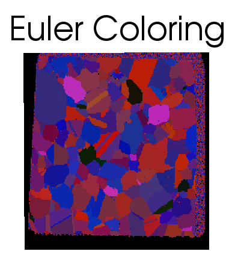

Generate Euler Colors {#generateeulercolors}
========

## Group (Subgroup) ##
Generic Filters (Misc)

## Description ##
This filter will generate an RGB color for each **Cell** that is calculated from the Euler Angles for the cell. **If you want IPF Colors this is NOT the filter for you**, use the [Generate IPF Colors](generateipfcolors.html) filter. The  algorithm is to assign a color component based on a scale of the following:

| Euler Component | Min Value (Radians) | Max Value (Radians) | Calculation |
|-----------------|---------------------|---------------------|-------------|
| phi1 (Euler 0)  |   0 | 2 Pi | phi1 / 2Pi \* 255 |
| Phi  (Euler 1)  | 0    | Pi | Phi / Pi \* 255 |
| phi2 (Euler 2) |   0 | 2 Pi | phi2 / 2Pi \* 255 |

### Example ###

Given the set of Euler Angles (0.43765, 0.265830, 5.583250) would result in RGB Values of [17, 21, 226].

------------------

@image latex EulerColor_1.png " " width=6in 

-------------------

@image latex IPFColor_1.png " " width=6in 

-------------------

## Input Options ##

None

## Required DataContainers ##

Voxel DataContainer

## Required Objects ##

| Type | Default Name | Description | Comment | Filters Known to Create Data |
|------|--------------|-------------|---------|------------------------------|
| Cell | CellEulerAngles | | These are the angles used to determine the colors | Read H5Ebsd File (IO), Match Crystallography (SyntheticBuilding) |

## Created Objects ##

| Type | Name | Description | Comment |
|------|------|-------------|---------|
| Cell | EulerColors | | The RGB colors are encoded as an unsigned char triplet  |

### Authors ##

## License & Copyright ##

Please see the description file distributed with this **Plugin**

## DREAM.3D Mailing Lists ##

If you need more help with a **Filter**, please consider asking your question on the [DREAM.3D Users Google group!](https://groups.google.com/forum/?hl=en#!forum/dream3d-users)

