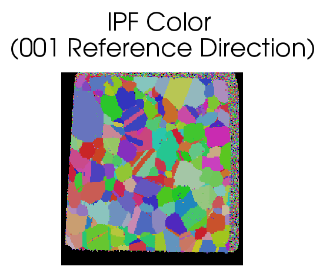

Generate IPF Colors {#generateipfcolors}
=============

## Group (Subgroup) ##
Processing (Crystallography)

## Description ##
This **Filter** will generate _inverse pole figure_ (IPF) colors for cubic, hexagonal or trigonal crystal structures. The user can enter the _Reference Direction_, which defaults to [001]. The **Filter** also has the option to apply a black color to all "bad" **Elements**, as defined by a boolean _mask_ array, which can be generated using the [Threshold Objects](@ref multithresholdobjects) **Filter**.

### Originating Data Notes ###

+ TSL (.ang file)
    - If the data originates from a TSL .ang file, then **Elements** that the TSL software could not reliably identify the Euler angles for will have a "Fit of Solution" = 180 and/or an "Image Quality" = 0.0.
    - This means that when the user runs some sort of [threshold](@ref multithresholdobjects) **Filter** the _mask_ will be those **Elements** that have an Image Quality > 0 and/or Fit < 180.0
+ HKL (.ctf file)
    - If the data originates from an HKL (or Bruker) system (.ctf file) then bad voxels can typically be found by setting "Error" > 0
    - This means that when the user runs some sort of [threshold](@ref multithresholdobjects) **Filter** the _mask_ will be those **Elements** that have an Error = 0

-----

@image latex images/IPFFilterLegend.tif "IPF Color Triangle" width=6in

-----

@image latex IPFColor_1.png "Example Data Set" width=6in

-----

## Parameters ##
| Name | Type | Description |
|------|------| ----------- |
| Reference Direction | float (3x) | The reference axis with respect to compute the IPF colors |
| Apply to Good Elements Only (Bad Elements Will Be Black) | bool | Whether to assign a black color to "bad" **Elements** |

## Required Geometry ##
Not Applicable

## Required Objects ##

| Kind | Default Name | Type | Component Dimensions | Description |
|------|--------------|------|----------------------|-------------|
| **Element Attribute Array** | EulerAngles | float | (3)  | Three angles defining the orientation of the **Element** in Bunge convention (Z-X-Z) |
| **Element Attribute Array** | Phases | int32_t | (1) | Phase Id specifying the phase of the **Element** |
| **Element Attribute Array** | Mask | bool | (1) | Used to define **Elements** as *good* or *bad*. Only required if _Apply to Good Elements Only (Bad Elements Will Be Black)_ is checked |
| **Ensemble Attribute Array** | CrystalStructures | uint32_t | (1) | Enumeration representing the crystal structure for each **Ensemble** |

## Created Objects ##

| Kind | Default Name | Type | Component Dimensions | Description |
|------|--------------|------|----------------------|-------------|
| **Element Attribute Array** | IPFColor |  uint8_t | (3) | The RGB colors encoded as unsigned chars for each **Element** |

## License & Copyright ##

Please see the description file distributed with this **Plugin**

## DREAM.3D Mailing Lists ##

If you need more help with a **Filter**, please consider asking your question on the [DREAM.3D Users Google group!](https://groups.google.com/forum/?hl=en#!forum/dream3d-users)

