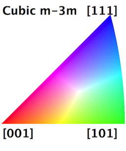

Generate IPF Colors {#generateipfcolors}
========

## Group (Subgroup) ##
Generic Filters (Misc)

## Description ##
This filter will generate Inverse Pole Figure colors for Cubic, Hexagonal or Trigonal Crystal Structures. The user can enter the Reference direction and is defaulted to [001]. The user is required to run a filter that will determine if a voxel should have it's color calculated by generating the _GoodVoxels_ array or an equivalent **boolean** array. Typically the **MultiThreshold Cells** or **Single Threshold Cells** filter is run _before_ this filter with an output array set to _GoodVoxels_.

### Originating Data Notes ###

+ TSL (.ang file)
    - If the data originates from a TSL .ang file then voxels that the TSL software could not reliably identify the Euler Angles will have a "Fit of Solution" = 180 and/or an "Image Quality" = 0.0.
    - This means that when the user runs some sort of threshold filter the _GoodVoxels_ will be those voxels that have an Image Quality > 0 and/or Fit < 180.0
+ HKL (.ctf file)
    - If the data originates from an HKL (or Bruker) system (.ctf file) then bad voxels can typically be found by setting "Error" > 0
    - This means that when the user runs some sort of threshold filter the _GoodVoxels_ will be those voxels that have an Error = 0

@image latex IPFFilterLegend.png " " width=2.5in

@image latex IPFColor_1.png " " width=5in

## Input Options ##

| Option | Type |
|-------|-------|
| X Reference Direction | Double |
| Y Reference Direction | Double |
| Z Reference Direction | Double |

## Required DataContainers ##

Voxel DataContainer

## Required Arrays ##

| Type | Default Name | Description  | Filters Known to Create Data |
|------|--------------|------------|-----|
| Cell | CellEulerAngles |  These are the angles used to determine the colors | Read H5Ebsd File (IO), Match Crystallography (SyntheticBuilding) |
| Cell | CellPhases |  These are used to determine which ensemble the **Cell** belongs to | Read H5Ebsd File (IO), Pack Primary Phases (SyntheticBuilding), Insert Precipitate Phases (SyntheticBuilding), Establish Matrix Phase (SyntheticBuilding) |  
| Cell | GoodVoxels | This is the boolean array that determines if a voxel will have its IPF Color generated or not. | [MultiThreshold Cells](multithresholdcells.html), [Single Threshold Cells](singlethresholdcells.html) |
| Ensemble | CrystalStructures |  These are the symmetries of the ensembles, which dictate orientation operations and which color palatte is used | Read H5Ebsd File (IO), Read Ensemble Info File (IO), Initialize Synthetic Volume (SyntheticBuilding) |

## Created Arrays ##

| Type | Name | Description |
|------|------|-------------|
| Cell | IPFColors | The RGB colors are encoded as an unsigned char triplet  |

### Authors ###

**Copyright:** 2015 BlueQuartz Software, LLC

**Contact Info:** dream3d@bluequartz.net

**Version:** 1.0.0

**License:** See the License.txt file that came with DREAM3D.

See a bug? Does this documentation need updated with a citation? Send comments, corrections and additions to [The DREAM3D development team](mailto:dream3d@bluequartz.net?subject=Documentation%20Correction)

