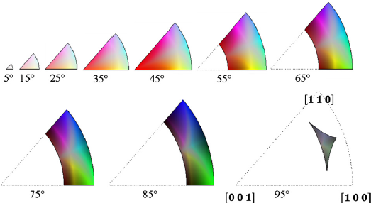
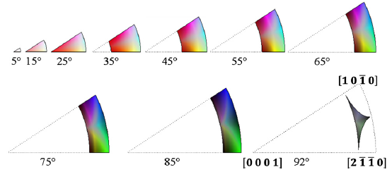
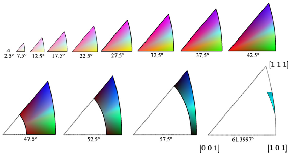

Generate Misorientation Colors {#generatemisorientationcolors}
=============

## Group (Subgroup) ##
Processing (Crystallography)

## Description ##
This **Filter** will generate colors based on the method developed by C. Schuh and S. Patala for cubic, hexagonal, tetragonal, or orthorhombic crystal structures (currently only the cubic high symmetry is working)[1]. Orientations are colored by _disorientation_ relative to a _reference orientation_. The user can enter a _Reference Orientation Axis_ and a _Reference Orientation Angle_ relative to the sample reference frame. The default reference orientation is the sample frame (misorientation from sample frame: 0o about [001]). The **Filter** also has the option to apply a black color to all "bad" **Elements**, as defined by a boolean _mask_ array, which can be generated using the [Threshold Objects](@ref multithresholdobjects) **Filter**.

### Important Implementation Notes ###
The user should be aware of the crystal symmetry (Laue Group and Point Group) of their data. The **Filter** is only valid for certain point groups within a Laue group (See table below).

### Color Output Notes ###
With other coloring methods, such as IPF, "bad" **Elements** which result from non-indexed EBSD scans can be colored with a black color. Since the misorientation coloring scheme uses all possible colors, marking voxels in an image in such a way that the voxels stand out is not possible.

### Crystal Symmetry Implementations ###

|Crystal Symmetry (Laue) | Hermann–Mauguin  Symbol | Schoenflies Symbol | Laue Class | Implemented  (Legend) |
|------------------------|-------------------------|-------------------| -----------|-----------------------|
| Triclinic | 1, -1  |  C1, C1 | -1 | Not Implemented|
| Monoclinic | 2, m, 2/m | C2, Cs, C2h | 2/m | Not Implemented |
| Orthorhombic | 222,, 2/m 2/m 2/m | D2, D2h | mmm |  |
| Orthorhombic | mm2 | C2v | mmm | Not Implemented |
| Trigonal (Low)|3, -3 | C3, C3i | -3 | Not Implemented |
| Trigonal (High)  | 32, 3m, -32/m | D3, C3v, D3d | -3m | Not Implemented |
| Tetragonal (Low) | 4, -4, 4/m | C4, S4, C4h | 4/m | Not Implemented |
| Tetragonal (High) | 422,  4/m 2/m 2/m | D4, D4h | 4/mmm |  |
| Tetragonal (High) | 4mmm, -42m | C4v, D2d | 4/mmm | Not Implemented|
| Hexagonal (Low) | 6, -6, 6/m | C6, C3h, C6h | 6/m | Not Implemented |
| Hexagonal  (High)| 622, 6/m 2/m 2/m | D6, D6h | 6/mmm |  |
| Hexagonal  (High)| 6mm, -62m | C6v, D3h | 6/mmm | Not Implemented |
| Cubic (Low) | 23, 2/m-3 | T, Th | m-3 |  |
| Cubic (High) | 432, 4/m -3 2/m | O, Oh| m-3m |  |
| Cubic (High) | -43m | Td| m-3m | Not Implemented |

### Example Output Images ###

-----

![Small IN100 courtesy of [2] showing a generally random texture](images/Small_IN100_Miso_90.png)
@image latex images/Small_IN100_Miso_90.png "Small IN100 courtesy of [2] showing a generally random texture" width=6in

-----

![Interstitial Free (IF) Steel courtesy of [3]](images/Miso_fw-ar-IF1-avtr12-corr.png)
@image latex images/Miso_fw-ar-IF1-avtr12-corr.png "Interstitial Free (IF) Steel courtesy of [3]" width=6in

-----

## Parameters ##
| Name | Type | Description |
|------|------| ----------- |
| Reference Orientation Axis | float (3x) | The reference axis with respect to compute the disorientation |
| Reference Orientation Angle (Degrees) | float | The reference angle with respect to compute the disorientation |
| Apply to Good Elements Only (Bad Elements Will Be Black) | bool | Whether to assign a black color to "bad" **Elements** |

## Required Geometry ##
Not Applicable

## Required Objects ##
| Kind | Default Name | Type | Component Dimensions | Description |
|------|--------------|-------------|---------|-----|
| **Element Attribute Array** | Quats | float | (3)  | Specifies the orientation of each **Element** in quaternion representation |
| **Element Attribute Array** | Phases | int32_t | (1) | Phase Id specifying the phase of the **Element** |
| **Element Attribute Array** | Mask | bool | (1) | Used to define **Elements** as *good* or *bad*. Only required if _Apply to Good Elements Only (Bad Elements Will Be Black)_ is checked |
| **Ensemble Attribute Array** | CrystalStructures | uint32_t | (1) | Enumeration representing the crystal structure for each **Ensemble** |

## Created Objects ##
| Type | Default Name | Type | Component Dimensions | Description |
|------|--------------|-------------|---------|-----|
| **Element Attribute Array** | MisorientationColors | uint8_t | (3) | The RGB colors encoded as unsigned chars |

## References ##

[1] S. Patala, J. Mason, C. Schuh, 2012. Improved representations of misorientation information for grain boundary science and engineering. Prog Mater Sci. 57, 1383-1425.

[2] M. Groeber, B.K. Haley, M.D. Uchic, D.M. Dimiduk, S. Ghosh, 3D reconstruction and characterization of polycrystalline microstructures using a FIB–SEM system Data Sets. Materials Characterization 2006, 57:259—-273.

[3] N. Allain-Bonasso, F. Wagner, S. Berbenni, D.P. Field, A study of the heterogeneity of plastic deformation in IF steel by EBSD, Materials Science and Engineering: A, Volume 548, 30 June 2012, Pages 56-63, ISSN 0921-5093, http://dx.doi.org/10.1016/j.msea.2012.03.068.
(http://www.sciencedirect.com/science/article/pii/S0921509312004388)

[4] http://reference.iucr.org/dictionary/Laue_classes

## License & Copyright ##

Please see the description file distributed with this plugin.

## DREAM.3D Mailing Lists ##

If you need more help with a **Filter**, please consider asking your question on the [DREAM.3D Users Google group!](https://groups.google.com/forum/?hl=en#!forum/dream3d-users)
