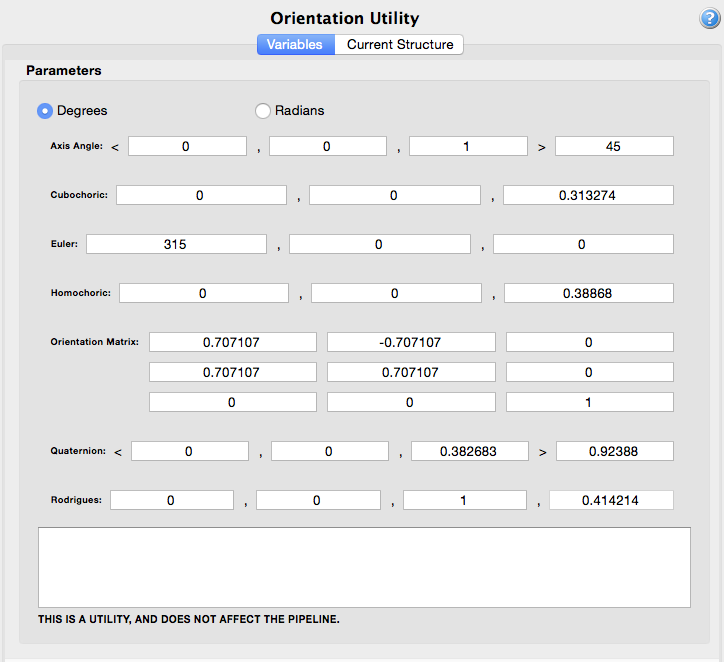
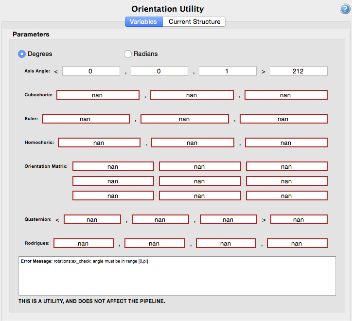

OrientationUtility {#orientationutility}
=============

## Group (Subgroup) ##
OrientationAnalysis (Utilities)

## Description ##
This **Filter** is a **Utility** that allows the user to compute alternate representations of an orientation based on a another representation. The supported representations are:

+ Euler Angles
+ Axis Angle
+ Cubochoric
+ Homochoric
+ Orientation Matrix
+ Quaternion
+ Rodrigues

To use the utility, simply drag the filter into the pipeline area and start entering values for a representation. The other representations will be instantly calculated as shown in figure 1 below. **The Axis-Angle and Rodrigues vectors are automatically normalized for the user.**

If the user enters invalid values for a representation, an error message will be displayed and all input fields will be marked with the **NaN** symbol as show in figure 2 below.

## References ##

[_Consistent representations of and conversions between 3D rotations_
D Rowenhorst, A D Rollett, G S Rohrer, M Groeber, M Jackson, P J Konijnenberg, and M De Graef
Published 5 October 2015 • © 2015 IOP Publishing Ltd • Modelling and Simulation in Materials Science and Engineering, Volume 23, Number 8](http://iopscience.iop.org/article/10.1088/0965-0393/23/8/083501)

## License & Copyright ##

Please see the description file distributed with this plugin.

## DREAM3D Mailing Lists ##

If you need more help with a filter, please consider asking your question on the DREAM3D Users mailing list:
https://groups.google.com/forum/?hl=en#!forum/dream3d-users

