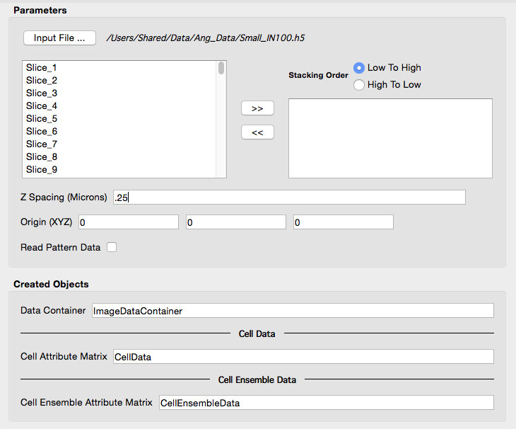
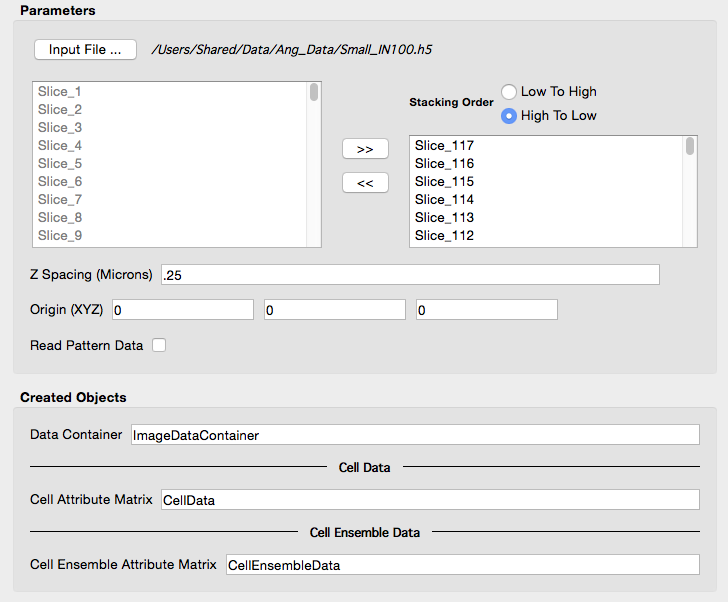

Read EDAX EBSD Data (.h5) {#readedaxh5data}
=============

## Group (Subgroup) ##
IO (Input)

## Description ##
This **Filter** will read a single .h5 file into a new **Data Container** with a corresponding **Image Geometry**, allowing the immediate use of **Filters** on the data instead of having to generate the intermediate .h5ebsd file. A **Cell Attribute Matrix** and **Ensemble Attribute Matrix** will also be created to hold the imported EBSD information. Currently, the user has no control over the names of the created **Attribute Arrays**.

| User interface before entering a proper "Z Spacing" value and selecting which scans to include. |
|-------|
||

| User interface AFTER setting the "Z Spacing" and selecting files.  |
|-------|
||

## Notes About Reference Frames ##

The user should be aware that simply reading the file then performing operations that are dependent on the proper crystallographic and sample reference frame will be undefined or simply **wrong**. In order to bring the [crystal reference frame](@ref rotateeulerrefframe) and [sample reference frame](@ref rotatesamplerefframe) into coincidence, rotations will need to be applied to the data. The recommended filters are:

+ [Rotate Euler Reference Frame](rotateeulerrefframe.html)
+ [Rotate Sample Reference Frame](rotatesamplerefframe.html)

If the data has come from a TSL acquisition system and the settings of the acquisition software were in the default modes, the following reference frame transformations may need to be performed based on the version of the OIM Analysis software being used to collect the data:

+ Sample Reference Frame: 180o about the <010> Axis
+ Crystal Reference Frame: 90o about the <001> Axis

The user also may want to assign un-indexed pixels to be ignored by flagging them as "bad". The [Threshold Objects](@ref multithresholdobjects) **Filter** can be used to define this _mask_ by thresholding on values such as _Confidence Index_ > xx or _Image Quality_ > desired quality.

## Parameters ##
| Name | Type | Description |
|------|------| ----------- |
| Input File | File Path | The input .h5 file path |
| Scan Name | Enumeration | The name of the scan in the .h5 file. EDAX can store multiple scans in a single file |
| Z Spacing | float | The spacing in microns between each layer. |
| Origin | float (3x1) | The origin of the volume |
| Read Pattern Data | bool | Default=OFF |

## Required Geometry ##
Not Applicable

## Required Objects ##
None

## Created Objects ## 

| Kind | Default Name | Type | Component Dimensions | Description |
|------|--------------|-------------|---------|-----|
| **Data Container**  | ImageDataContainer | N/A | N/A    | Created **Data Container** name with an **Image Geometry** |
| **Attribute Matrix**  | CellData | Cell | N/A    | Created **Cell Attribute Matrix** name  |
| **Attribute Matrix**  | CellEnsembleData | Cell Ensemble | N/A    | Created **Cell Ensemble Attribute Matrix** name  |

### Created Cell Attribute Arrays ###

These arrays will **most likely** be created but is not guaranteed. Additional arrays (unknown at the time of writing) may also be created.

| Kind | Default Name | Type | Component Dimensions | Description |
|------|--------------|-------------|---------|-----|
| **Cell Attribute Array**  | Confidence Index | float |(1)     | Confidence of indexing  |
| **Cell Attribute Array**  | EulerAngles      | float |(3)     | Three angles defining the orientation of the **Cell** in Bunge convention (Z-X-Z)  |
| **Cell Attribute Array**  | Fit              | float |(1)     |  Quality of fit for indexing  |
| **Cell Attribute Array**  | Image Quality    | float |(1) | Quality of image   |
| **Cell Attribute Array**  | Phases           | int32_t   | (1) | Specifies to which phase each **Cell** belongs   |
| **Cell Attribute Array**  | SEM Signal       | float |(1) | Value of SEM signal   |
| **Cell Attribute Array**  | X Position       | float |(1) | X coordinate of **Cell**   |
| **Cell Attribute Array**  | Y Position       | float |(1) | Y coordinate of **Cell**   |
| **Cell Attribute Array**  | Pattern           | uint8_t   | (NxM) | The pattern data may be very large. There is an option to NOT read it into DREAM.3D if it is not needed by the analysis.   |

### Created Ensemble Attribute Arrays ###

These arrays will **most likely** be created but is not guaranteed. Additional arrays (unknown at the time of writing) may also be created.

| Kind | Default Name | Type | Component Dimensions | Description |
|------|--------------|-------------|---------|-----|
| **Ensemble Attribute Array** | CrystalStructures | uint32_t | (1) | Enumeration representing the crystal structure for each **Ensemble** |
| **Ensemble Attribute Array** | LatticeConstants | float | (6) | The 6 values that define the lattice constants for each **Ensemble**|
| **Ensemble Attribute Array** | MaterialName | String | (1) | Name of each **Ensemble** |

## License & Copyright ##

Please see the description file distributed with this **Plugin**

## DREAM.3D Mailing Lists ##

If you need more help with a **Filter**, please consider asking your question on the [DREAM.3D Users Google group!](https://groups.google.com/forum/?hl=en#!forum/dream3d-users)

