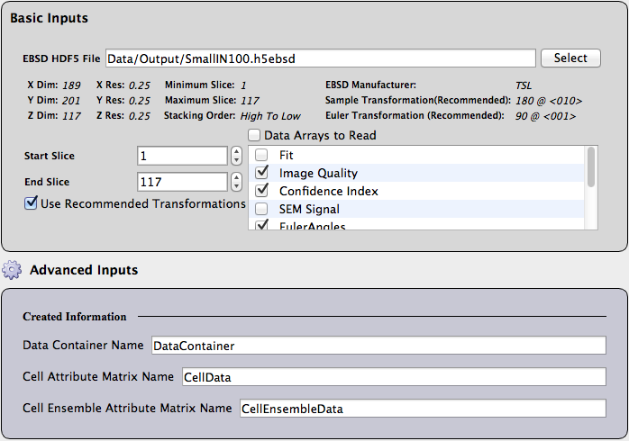

Read H5EBSD File {#readh5ebsd}
=============

## Group (Subgroup) ##
IO (Input)

## Description ##

This **Filter** reads from the .h5ebsd file that was generated with the [Import Orientation File(s) to H5EBSD](ebsdtoh5ebsd.html) **Filter**. 

-----

@image latex images/ReadH5Ebsd_UI.png "Read H5Ebsd File User Interface" width=6in

-----

+ The user can use the checkboxes under the _Data Arrays to Read_ section to select which specific data arrays they are interested in importing.
+ The user can select a subset of the slices if they do not wish to import the entire volume.
+ The type of transformations that are recommended based on the manufacturer of the data are also listed with a checkbox that allows the user to toggle the recommended transformations on and off.
+ The user should select the Euler angle representation. (This is **only** available if the **Use Recommended Transformations** is turned **on**.)

### Notes About Transformations ###

The **user** is solely responsible for knowing any sample reference frame transformations, crystal reference frame transformations and how the Euler angles are represented in the file. DREAM.3D provides historically correct transformations from a few of the EBSD manufacturers under the assumption that the EBSD instrument has been setup according to their guidelines. The **user** is strongly encouraged to discuss these topics with the person(s) who were responsible for collecting the data. For example the  IPF images presented below were generated from an H5Ebsd file that was generated using a CTF file. The difference is that the **Incorrect** image did not correctly select the **Angle Representation** combo box on the filter's user interface. The Euler angles were actually in degrees but were treated as if the values were in radians. The correct image is on the right.

If the user does not want the **Read H5Ebsd** filter to perform any transformations then the checkbox can be unchecked and the user can manually perform any desired transformations by inserting the appropriate filters into the pipeline. The suggested filters are:

+ [Rotate Euler Reference Frame](rotateeulerrefframe.html)
+ [Rotate Sample Reference Frame](rotatesamplerefframe.html)
+ [Convert Angles to Degrees or Radians](changeanglerepresentation.html)

| Incorrect | Correct |
|---------|---------|
| |  |
| Euler angles were treated as Radians | Euler angles were converted from Degrees to Radians |
|"Interstitial Free (IF) Steel courtesy of [1]"| |

## Parameters ##
| Name | Type | Description |
|------|------| ----------- |
| Input File | File Path | The input .h5ebsd file path |
| Start Slice | Int | The first slice of data to read |
| End Slice | Int | The last slice of data to read |
| Use Recommended Transformations | bool | Whether to apply the listed recommended transformations |
| Data Arrays to Read | Bool(s) | Whether to read the listed arrays |
| Angle Representation | Int (0=Radians, 1=Degrees) | How the Euler Angles are represented. |

## Required Geometry ##
Not Applicable

## Required Objects ##
None

## Created Objects ##
| Kind | Default Name | Type | Component Dimensions | Description |
|------|--------------|-------------|---------|-----|
| **Data Container**  | ImageDataContainer | N/A | N/A    | Created **Data Container** name with an **Image Geometry** |
| **Attribute Matrix**  | CellData | Cell | N/A    | Created **Cell Attribute Matrix** name  |
| **Attribute Matrix**  | CellEnsembleData | Cell Ensemble | N/A    | Created **Cell Ensemble Attribute Matrix** name  |

An array for each of the arrays selected in the _Data Arrays to Read_ section will also be created.

## License & Copyright ##

Please see the description file distributed with this **Plugin**

## References ##

[1] N. Allain-Bonasso, F. Wagner, S. Berbenni, D.P. Field, A study of the heterogeneity of plastic deformation in IF steel by EBSD, Materials Science and Engineering: A, Volume 548, 30 June 2012, Pages 56-63, ISSN 0921-5093, http://dx.doi.org/10.1016/j.msea.2012.03.068.
(http://www.sciencedirect.com/science/article/pii/S0921509312004388)

## DREAM.3D Mailing Lists ##

If you need more help with a **Filter**, please consider asking your question on the [DREAM.3D Users Google group!](https://groups.google.com/forum/?hl=en#!forum/dream3d-users)

