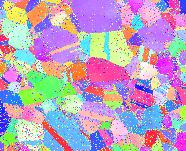
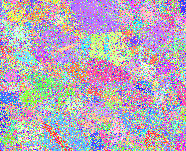
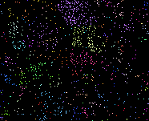
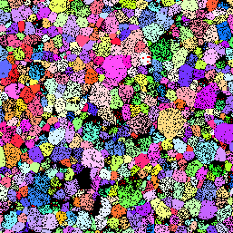
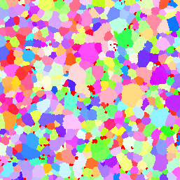

Replace Element Attributes with Neighbor (Threshold) {#replaceelementattributeswithneighborvalues}
======

## Group (Subgroup) ##
Processing (Cleanup)

## Description ##
This **Filter** first identifies all **Cells** that have a value that meets the selected threshold value set by the user.  Then, for each of those **Cells**, their neighboring **Cells** are checked to determine the neighbor **Cell** with maximum or minimum value. The attributes of the neighbor with the maximum/minimum value are then reassigned to the reference **Cell**.

*Note:* By default, the **Filter** will run only one iteration of the cleanup.  If the user selects the *Loop Until Gone* option, then the **Filter** will run iteratively until no **Cells** exist that meet the users criteria. So, if a **Cell** meets the threshold and so are all of its neighbors, then that **Cell** will not be changed during that iteration and will remain unchanged until one of its neighbors gets changed by a **Cell** further away.

## Examples ##

### TSL Data (.ang) File ###

When attempting to "clean up" EBSD data generated by EDAX/TSL the Attribute Array "Confidence Index" can be used. Confidence Index is a measure of how confident in the indexing results given by the OIM Analysis software and ranges from 0.0 (No confidence) to 1.0 (Absolute confidence). More information about the Confidence Index can be found in the OIM analysis user manual. Typical inputs for TSL (.ang) Data might be the following.

| Filter Parameter | Value |
|------------------|-------|
| Threshold Value | 0.1 |
| Operator | < |
| Selected Array | [DataContainer] / CellData / Confidence Index |
| Loop Until Gone | User dependent |

Using these values says that for every cell that has a confidence index < 0.1 it's neighbor cells will be considered. If the neighbor cell has a confidence > 0.1 AND is greater than the other neighbors then this cell's data will be copied into the original cell data location.

### Example EDAX Results ###

**Reasonable Use of the Filter**

| Original Data |  | After Running Filter | True Data |
|----------| ----------| ----------| ----------|
|  |  | |  |

**Example of Too Much Replacement**

| Original Data | Threshold CI < 0.1 | After Running Filter | True Data |
|----------| ----------| ----------| ----------|
|  |  | |  |

Note how in the above use of the filter the grain morphology is substantially changed from the exemplar data. Except for very large grains being similar most of the fine grains and twins are **NOT** reproduced from the original.

### Oxford/Bruker (.ctf) File ###

Oxford Instruments and Bruker CTF data files do not include a "Confidence Index" measure. There are several measures such as _Mean Angular Deviation (MAD)_ or _Bands_ but these values are not filled in or are defaulted to 0 (Zero) if the scan point was not indexed. By using the _Error_ value from the data file we can get the same effect as the EDAX _Confidence Index_. The user would use the following input values:

| Filter Parameter | Value |
|------------------|-------|
| Threshold Value | 0.0 |
| Operator | > |
| Selected Array | [DataContainer] / CellData / Error |
| Loop Until Gone | User dependent |

### Example Oxford/Bruker Results ###

| Original Data | After Running Filter |
|----------| ----------|
|  |   |

Note the large areas of unindexed pixels in the original image (black pixels) and how they are all filled in. The filter can act much like a generic "flood fill" image processing algorithm if used improperly.

## Parameters ##
| Name | Type | Description |
|------|------|-------------|
| Threshold Value | Any | Sets the threshold value a **Cell** must have to be considered for changing |
| Comparison Operator | Int | Selects the operator to use. 0 = < (Less Than). 1 = > (Greater Than) |
| Loop Until Gone | bool | Whether to iterate until all **Cells** are above the minimum tolerance or just run one iteration |

## Required Geometry ##
Image

## Required Objects ##
| Kind | Default Name | Type | Component Dimensions | Description |
|------|--------------|------|----------------------|-------------|
| **Cell Attribute Array** | N/A | Any | (1) | The DataArray to use as input into the filter. |

## Created Objects ##
None

## License & Copyright ##

Please see the description file distributed with this **Plugin**

## DREAM.3D Mailing Lists ##

If you need more help with a **Filter**, please consider asking your question on the [DREAM.3D Users Google group!](https://groups.google.com/forum/?hl=en#!forum/dream3d-users)

