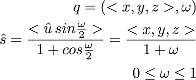

Stereographic3D {#stereographic3d}
=============

## Group (Subgroup) ##

OrientationAnalysis (Conversion Filters)

## Description ##

This **Filter** takes a set of quaternions as input and projects them into a 3D unit-radius ball using an equal-angle projection, i.e., a stereographic projection.  This is a convenient and intuitive way to represent in 3D the quaternion unit hemisphere, which lives embedded in a 4D space, in the same way that a standard 2D stereographic projection represents data lying on the surface of a 2D spherical surface embedded in a 3D space.  The filter generates a set of 3D stereographic coordinates, all of which have a modules less than or equal to 1.  Starting from the quaternion *q*, with scalar part *w*, the filter computes the stereographic vectors, **s**, according to the following relation: 

**Note that if the value of w equals -1.0 then the filter will exit early and present an error. This is because with a value of -1 the output value would divide by zero.  This should not happen if the angle ω falls inside the proper range.**

### Data Layout Notes ###

DREAM.3D orders a quaternion as ( < x, y, z >, w)>. If you are importing quaternions from another source, please ensure that the quaternions are in the correct order.

## Parameters ##

None

## Required Geometry ##

Not Applicable

## Required Objects ##
| Kind | Default Name | Type | Component Dimensions | Description |
|------|--------------|-------------|---------|-----|
| **Element Attribute Array** | Quats | float | (4) | Specifies the orientation of the **Element** in quaternion representation |

## Created Objects ##
| Kind | Default Name | Type | Component Dimensions | Description |
|------|--------------|------|----------------------|-------------|
| **Attribute Array** | Coordinates | float | 3 | Converted quaternion |

## License & Copyright ##

Please see the description file distributed with this plugin.

## DREAM3D Mailing Lists ##

If you need more help with a filter, please consider asking your question on the DREAM3D Users mailing list:
https://groups.google.com/forum/?hl=en#!forum/dream3d-users