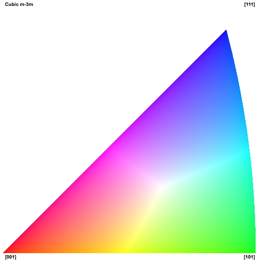

Export IPF Triangle Legend (Cubic m-3m) {#writeipfstandardtriangle}
=============

## Group (Subgroup) ##
IO (Output)

## Description ##
This **Filter** will generate a standard inverse pole figure color stereographic triangle that is used for typical EBSD visualizations and other visualizations from orientation data. The user can adjust the size and type of the output file.

**Currently the only supported triangle is for Cubic (m-3m) crystal symmetry.**

-----

@image latex Images/IPFFilterLegend.png "Cubic Standard Stereographic Triangle" width=6in

-----

## Parameters ##
| Name | Type | Description |
|------|------| ----------- |
| Output File | File Path | The output file path. Currently supports .tif, .bmp, and .png file formats |
| Image Size (Square Pizels) | Int | Size of the output image in square pixels |   

## Required Geoemtry ##
Not Applicable

## Required Objects ##
None

## Created Objects ##
None

## License & Copyright ##

Please see the description file distributed with this **Plugin**

## DREAM.3D Mailing Lists ##

If you need more help with a **Filter**, please consider asking your question on the [DREAM.3D Users Google group!](https://groups.google.com/forum/?hl=en#!forum/dream3d-users)

