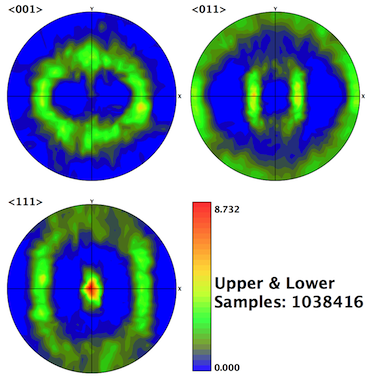

Write Pole Figure Images {#writepolefigure}
=============

## Group (Subgroup) ##
IO (Output)

## Description ##
This **Filter** creates a standard pole figure image for each **Ensemble** in a selected **Data Container** with an **Image Geometry**. The **Filter** uses Euler angles in radians and requires the crystal structures for each **Ensemble** array and the corresponding **Ensemble** Ids on the **Cells**. The **Filter** also requires a _mask_ array to determine which **Cells** are valid for the pole figure computation.

The pole figure algorithm uses a _modified Lambert square_ to perform the interpolations onto the circle. This is an alternate type of interpolation that the EBSD OEMs do not perform which may make the output from DREAM.3D look slightly different than output obtained from the OEM programs.

**Only an advanced user with intimate knowledge of the modified Lambert projection should attempt to change the value for the "Lambert Image Size (Pixels)" input parameter.**

-----

@image latex images/PoleFigure_Example.png "Example Pole Figure Using Square Layout" width=6in

-----

## Parameters ##
| Name | Type | Description |
|------|------| ----------- |
| Image Format | Enumeration | Image file format to write. Currently supports .tif, .bmp, and .png file formats |
| Lambert Image Size (Pixels) | int32_t | Size of the Lambert square in pixels |
| Number of Colors | int32_t | Number of colors to use to make the pole figure |
| Image Layout | Enumeration | Layout for the resulting pole figure images, either square, horizontal, or vertical |
| Image Prefix | String | Prefix the prepend each pole figure file with |
| Output Path | File Path | Output directory path for images |
| Image Size (Square Pixels) | int32_t | Size of the output image in square pixels |
 
## Required Geometry ##
Image

## Required Objects ##

| Kind | Default Name | Type | Component Dimensions | Description |
|------|--------------|------|----------------------|-------------|
| **Cell Attribute Array** | EulerAngles | float | (3)  | Three angles defining the orientation of the **Cell** in Bunge convention (Z-X-Z) |
| **Cell Attribute Array** | Phases | int32_t | (1) | Specifies to which **Ensemble** each **Cell** belongs |
| **Cell Attribute Array** | Mask | bool | (1) | Used to define **Cells** as *good* or *bad* |
| **Ensemble Attribute Array** | CrystalStructures | uint32_t | (1) | Enumeration representing the crystal structure for each **Ensemble** |

## Created Objects ##
None

## License & Copyright ##

Please see the description file distributed with this **Plugin**

## DREAM.3D Mailing Lists ##

If you need more help with a **Filter**, please consider asking your question on the [DREAM.3D Users Google group!](https://groups.google.com/forum/?hl=en#!forum/dream3d-users)

