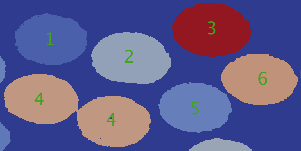
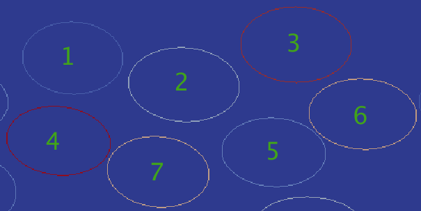
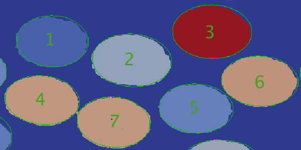

# Detect Ellipsoids  #

## Group (Subgroup) ##

FiberToolbox (FiberToolbox)

## Description ##

This **Filter** detects ellipsoids in an existing 2D **Feature Ids** array, and outputs a new 2D **Detected Ellipsoids Feature Ids** array that contains the outlines of all the ellipses that were found, as well as several other arrays that contain center coordinate, major axis length, minor axis length, and rotational angle values.  The algorithm is based on a 1D accumulation array, and is described in the following paper:

[1] C. P. Przybyla, S. Bricker, J. P. Simmons, and R. Hardie, "Automated Microstructure-Properties Characterization and Simulation in Brittle Matrix Continuous Fiber Reinforced Composites.", **29th Annual Technical Conference of the American Society for Composites 2014**, Vol. 1

## Ellipse Detection Example ##

The ellipse detection algorithm processes a 2D **Feature Ids** array that contains objects that are segmented by feature.  **Figure 1** shows a snippet of the original **Feature Ids** array.  Each object in **Figure 1** has an assigned feature id between 1 - 6.

**Figure 2** contains the outlines of the detected ellipses, which is one of the outputs of this filter.  Some segmented objects may have multiple ellipses in them, so the algorithm separates out each additional ellipse and assigns it a new, unique feature id.  In this case, the algorithm detected two ellipses in feature 4's object, so the second ellipse from feature 4 was assigned a feature id of 7.

In **Figure 3**, the outlines of the detected ellipses, colored in green, are overlayed on top of the original feature ids array.

## Algorithm ##

The ellipse detection algorithm has 16 steps.

1. Find corner coordinates of each feature id and use them to calculate each feature id object's dimensions

2. Using the dimensions, copy the feature id object into its own 2D array.

3. Calculate the orientation matrix and hough circle matrix, then use them to create the convolution matrix

4. Find the gradient matrix of the object, and then convolute it with the convolution matrix found in Step 3.

5. Calculate the magnitude matrix of the convolution.

6. Smooth the magnitude matrix using a smoothing filter.

7. Find the max peak of the magnitude matrix to use as a threshold.

8. Create threshold matrix by copying values that are greater than (0.7 * maxPeak) from magnitude matrix.

9. Find all local extrema coordinates in the threshold matrix; the number of extrema values determines how many sub-objects are in the feature id object.  Remember, some feature id objects could be made up of multiple ellipses. The coordinates of each extrema value is the center coordinate of each sub-object within the feature id object.

10. Create a mask array for the sub-object.

11. Compute the edge matrix of the sub-object, and use it along with the center coordinates to determine edge pairs that will be analyzed to determine if the sub-object is an ellipse.

12. Analyze each edge pair using an accumulation array to gain votes to help determine that the sub-object is an ellipse.  The edge pair analysis algorithm is detailed in the scientific paper in the **Description** section above.

13. If the sub-object is found to be an ellipse, then store the center coordinates, major axis length, minor axis length, and rotational angle in their respective output arrays with the sub-object's feature id as the index.  If an ellipse has already been found using this feature id (in other words, this is a feature id that has multiple ellipses in it), then generate a new, unique feature id and store this sub-object's information at that index instead.

14. Remove the sub-object from the feature id object's 2D array, and repeat steps 4-12 until either the feature id object has run out of sub-objects, or the total number of pixels in the feature id object is below a certain minimum pixel threshold.

15. Repeat steps 2-13 for each feature id in the **Feature Ids** array.

16. Plot each ellipse in **Detected Ellipsoids Feature Ids** array.

## Parameters ##

| Name | Type | Description |
|------|------|-------------|
| Min Fiber Axis Length (in units of image scale bar) | Integer | The minimum length of the fiber axis |
| Max Fiber Axis Length (in units of image scale bar) | Integer | The maximum length of the fiber axis |
| Threshold for Hough Transform | Double | Threshold used in the Hough Transform algorithm |
| Minimum Aspect Ratio | Double | Minimum Aspect Ratio |
| Length of Image Scale Bar (in units of image scale bar) | Integer | Length of the Image Scale Bar |

## Required Geometry ##

Image

## Required Objects ##

| Kind | Default Name | Type | Component Dimensions | Description |
|------|--------------|------|----------------------|-------------|
| Cell **Attribute Array** | FeatureIds | int32_t | (1) | The Feature Ids array to analyze for ellipsoids |
| CellFeature **Attribute Array** | Active | bool | (1) | The array that denotes the Feature Ids that are active in the Feature Ids array |

## Created Objects ##

| Kind | Default Name | Type | Component Dimensions | Description |
|------|--------------|------|----------------------|-------------|
| **Attribute Matrix**  | EllipsoidFeatureAttributeMatrix | Any | N/A | **Attribute Matrix** to store center coordinates, major axis length, minor axis length, and rotational angles arrays  |
| CellFeature **Attribute Array** | EllipsoidsCenterCoords | int32_t | (2) | The center coordinates array of detected ellipsoids |
| CellFeature **Attribute Array** | EllipsoidsMajorAxisLength | int32_t | (1) | The major axis length array of detected ellipsoids |
| CellFeature **Attribute Array** | EllipsoidsMinorAxisLength | int32_t | (1) | The minor axis length array of detected ellipsoids |
| CellFeature **Attribute Array** | EllipsoidsRotationalAngles | int32_t | (1) | The rotational angles array of detected ellipsoids |
| Cell **Attribute Array** | DetectedEllipsoids | int32_t | (1) | The Feature Ids array that contains detected ellipsoids |

## Example Pipelines ##

## License & Copyright ##

Please see the description file distributed with this plugin.

## DREAM3D Mailing Lists ##

If you need more help with a filter, please consider asking your question on the DREAM3D Users mailing list:
