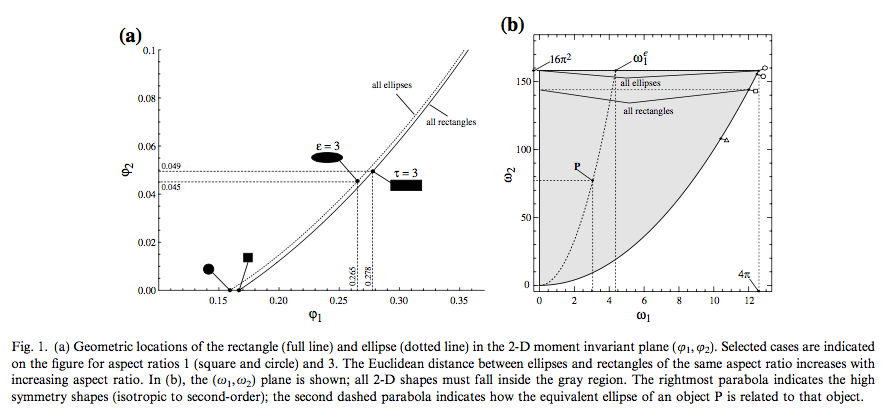

Compute MomentInvariants (2D) {#computemomentinvariants2d}
=============

## Group (Subgroup) ##

Statistics (Statistics)

## Description ##

This **Filter** computes the 2D Omega-1 and Omega 2 values from the _Central Moments_ matrix and optionally will normalize the values to a unit circle and also optionally save the _Central Moments_ matrix as a DataArray to the *Cell Feature Attribute Matrix*. Based off the paper by MacSleyne et. al [1], the algorithm will calculate the 2D central moments for each feature starting at *feature id = 1*. Because *feature id 0* is of special significance and typically is a matrix or background it is ignored in this filter. If any feature id has a Z Delta of > 1, the feature will be skipped. This algorithm works strictly in the XY plane and is meant to be applied to a 2D image. Using the research from the cited paper certain shapes can be detected using the Omega-1 and Omega-2 values. An example usage is finding elliptical shapes in an image:

See below figure from [1] that can help the user classify objects.

## Parameters ##

| Name | Type | Description |
|------|------|-------------|
| Normalize MomentInvariants | Bool | Should the algorithm normalize the results to unit circle. |
| Save Central Moments | Bool | Write the Central Moments to a new Data Array |

## Required Geometry ##

ImageGeom

  CentralMomentsArrayPath 2

## Required Objects ##

| Kind | Default Name | Type | Component Dimensions | Description |
|------|--------------|------|----------------------|-------------|
| Cell **Attribute Array** | FeatureIds | int32_t | (1) | The Feature Ids array to analyze for ellipsoids |
| Cell **Attribute Array** | FeatureRectArray | int32_t | (4) | Array holding the min xy and max xy pixel coordinates of each feature id |

## Created Objects ##

| Kind | Default Name | Type | Component Dimensions | Description |
|------|--------------|------|----------------------|-------------|
| Cell **Attribute Array** | Omega1 | float | (1) | Omega1 value  |
| Cell **Attribute Array** | Omega2 | float | (1) | Omega2 value  |
| Cell **Attribute Array** | CentralMoments | float | (3)(3) | Central Moments value  |

# Citations #

[1] J.P. MacSleyne, J.P. Simmons, M. De Graef, *On the use of 2-D moment invariants for the automated classification of particle shapes*, Acta Materialia, Volume 56, Issue 3, February 2008, Pages 427-437, ISSN 1359-6454, [http://dx.doi.org/10.1016/j.actamat.2007.09.039.](http://dx.doi.org/10.1016/j.actamat.2007.09.039.)
[http://www.sciencedirect.com/science/article/pii/S1359645407006702](http://www.sciencedirect.com/science/article/pii/S1359645407006702)

# Acknowledgements #

The authors would like to thank Dr. Marc De Graef from Carnegie Mellon University for enlightening discussions and a concrete implementation from which to start this filter.

## License & Copyright ##

Please see the description file distributed with this plugin.

## DREAM3D Mailing Lists ##

If you need more help with a filter, please consider asking your question on the DREAM3D Users mailing list:
https://groups.google.com/forum/?hl=en#!forum/dream3d-users