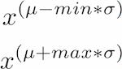

Generate Primary StatsData {#generateprimarystatsdata}
=====

## Group (Subgroup) ##
StatsGenerator (StatsGenerator)

## Description ##
This filter allows the user to generate statistics for a **Primary** phase that is suitable for use as an input into the @see InsertPrimaryPhases filter when generating a synthetic microstructure. The goal of this particular filter is in the use/generation of automated pipeline files. In this scenario the power user is wanting to generate a varied array of microstructures using some sort of scripting environment or language. By careful replacements of the values in a pipeline file the user can automate the generation of a synthetic microstructure.
If the use wishes to have a more interactive environment in which to explore the various distribution curves then the @see **StatsGenerator** filter should be used instead.

### Centrosymmetric Groups (Laue Groups) ###

| Name | Value | Notes |
|------|------|------|
| Hexagonal_High | 0 |  Hexagonal-High 6/mmm |
| Cubic_High | 1 |  Cubic Cubic-High m3m |
| Hexagonal_Low | 2 |  Hexagonal-Low 6/m |
| Cubic_Low | 3 |  Cubic Cubic-Low m3 (Tetrahedral) |
| Triclinic | 4 |  TriClinic -1 |
| Monoclinic | 5 |  Monoclinic 2/m |
| OrthoRhombic | 6 |  OrthoRhombic mmm |
| Tetragonal_Low | 7 |  Tetragonal-Low 4/m |
| Tetragonal_High | 8 |  Tetragonal-High 4/mmm |
| Trigonal_Low | 9 |  Trigonal-Low -3 |
| Trigonal_High | 10 |  Trignal-High -3m |
| LaueGroupEnd | 11 |  The end of the Laue groups |
| UnknownCrystalStructure | 999 |  UnknownCrystalStructure |

## Parameters ##

| Name | Type | Description |
|------|------|-------------|
| PhaseName | String | Name of the Phase |
| PhaseIndex | int | Index of the Phase (One based) |
| CrystalSymmetry | int | 1 ~ 11 that represents the Crystal Symmetry |
| MicroPresetModel | int | Preset Model ( 0|Equiaxed, 1|Rolled, 2|Recrystallized) |
| PhaseFraction | double | The fraction of phase in the synthetic volume |
| Mu | double | The average value of the lognormal grain size distribution. Note that this is the average value of log(ESD).  This value is in the same arbitrary units of length, but is not the average **Feature** size|
| Sigma | double | The standard deviation of the lognormal grain size distribution.  Note that this is not the standard deviation of the actual **Feature** size distribution, but of the log(ESD) values.  This value controls the length of the "tails" of the distribution
| MinCutOff | double | Allows the user to truncate the distribution to remove very large (or small) **Features** |
| MaxCutOff | double | Allows the user to truncate the distribution to remove very large (or small) **Features** |
| BinStepSize | double | The size of bin to use in segregating the **Feature** size distribution into classes for correlating other statistics to **Feature** size. |
| CreateEnsembleAttributeMatrix | bool | Create an Ensemble AttributeMatrix |
| DataContainerName | String | The name of the DataContainer to use |
| CellEnsembleAttributeMatrixName | String | Name of the Cell Ensemble AttributeMatrix |
| AppendToExistingAttributeMatrix | bool | Append the phase to an existing Cell Ensemble AttributeMatrix |
| SelectedEnsembleAttributeMatrix | DataArrayPath | The DataArrayPath to store the new phase |
| OdfData | DynamicTableData | Weights for the ODF generation |
| MdfData | DynamicaTableData | Weights for the MDF generation |
| AxisOdfData | DynamicTableData | Weights for the AxisODF Generation |

## Required Geometry ##
Not Applicable

## Required Objects ##

| Kind | Default Name | Type | Component Dimensions | Description |
|------|--------------|------|----------------------|-------------|

## Created Objects ##

| Kind | Default Name | Type | Component Dimensions | Description |
|------|--------------|------|----------------------|-------------|
| StatsData |  | N/A | N/A | A StatsData object that contains the generated statistics for the phase |

## License & Copyright ##

Please see the description file distributed with this plugin.

## DREAM3D Mailing Lists ##

If you need more help with a filter, please consider asking your question on the DREAM3D Users mailing list:
https://groups.google.com/forum/?hl|en#!forum/dream3d-users