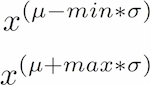
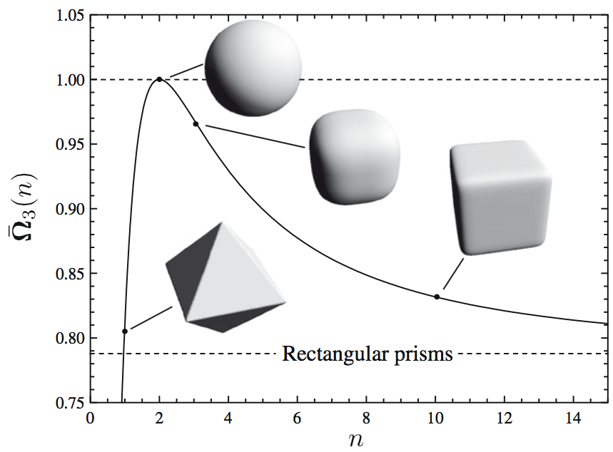
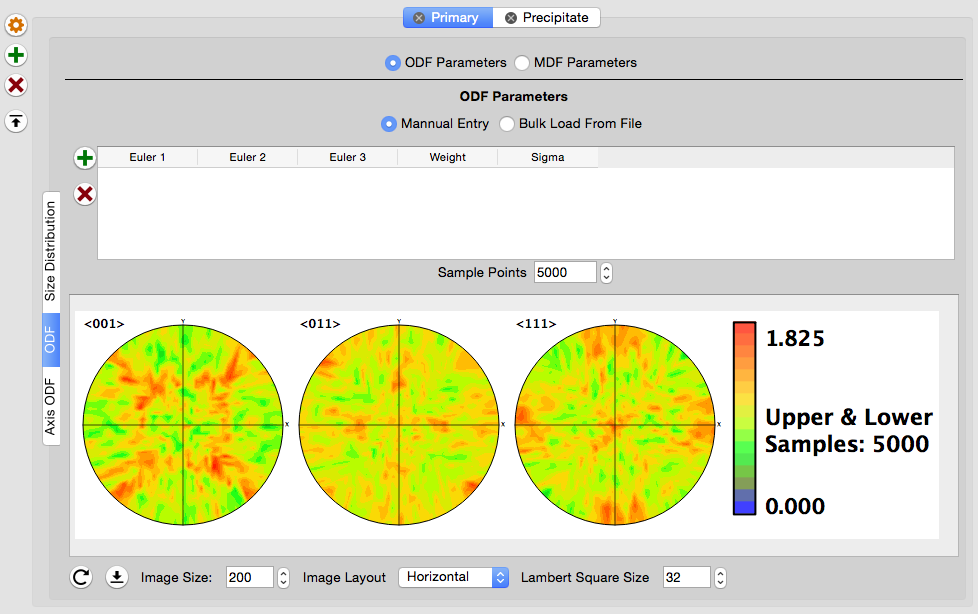
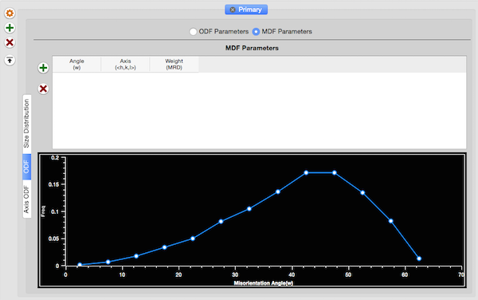
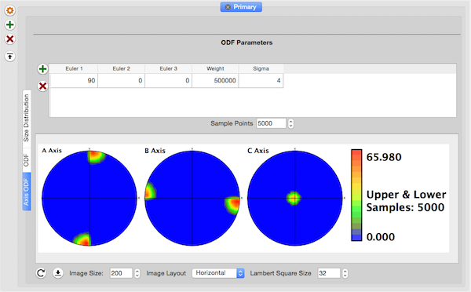

StatsGenerator {#statsgeneratorfilter}
=============

## Group (Subgroup) ##
Synthetic Building (Generation)

## Description ##
This **Filter** creates the arrays necessary to [generate synthetic microstructures](@ref tutorialsyntheticsingle).

The StatsGenerator **Filter** was created to allow users to quickly generate a set of statistics that can be used to create a synthetic microstructure. Using this  **Filter**, the user can generate the necessary statistics that describe a microstructure, with the aid of visual plots of the statistics, and immediately use them in the **Pipeline** to generate a synthetic microstructure. The statistics data can also be [saved to a DREAM.3D file](@ref datacontainerwriter) for later use.

The set(s) of statistics that can be generated in this program correspond to the set(s) used by "**Feature** packing algorithms" in DREAM.3D.  DREAM.3D chooses to classify **Features** in *Phase Types*, which define the set of statistics used to describe the key metrics for those **Features**.  The *Phase Types* that can currently be selected in DREAM.3D are _Primary_, _Precipitate_ and _Matrix_.  The statistics that describe each of these *Phase Types* are listed below:

| Primary | Precipitate  | Matrix  |
|---------|--------------|---------|
| {Volume fraction} | {Volume fraction} |{Volume fraction} |
| {crystal structures} | {crystal structures}|{crystal structure} |
|  | {fraction on **Feature** boundary} | |
| size | size |  |
|  shape (aspect ratios) |shape (aspect ratios) |  |
|  Omega3 |Omega3 |  |
|  | radial distribtion function (RDF) | |
|  number of neighbors | |  |
|  ODF (crystallographic orientation) |ODF (crystallographic orientation) |  |
|  MDF |MDF |  |
|  axis ODF (morphological orientation) | axis ODF (morphological orientation)|  |

*Stats designated with a { } are located on the Phase Properties Manager*

## Phase Properties ##

The user can use the following buttons to add, remove or edit a phase
+ Add 
+ Delete 
+ Edit 

The user can add, remove or modify properties of the phase by clicking the *Phase Properties Buttons* at the bottom of the StatsGenerator GUI. The _plus button_ allows the user to add a phase, the _minus button_ allows the user to remove a phase, and the _cogwheel button_ allows the user to edit the currently selected phase.

@image latex Images/SG_PhaseProperties.png "Phase Properties Manager" width=6in

The *Phase Properties* is a dialog where the user can enter information about the phase for which statistics are currently being generated. The following items can be set in the manager:

+ **Select Crystal Structure**: Allows the user to specify the crystal structure of the phase
+ **Fraction**: The _volume fraction_ of the phase. The _Calculated Phase Fraction_ is updated as more phases are added, by scaling the current total of all the phases fractions to 1 (in case the user's total is not equal to 1 when finished)
+ **Select Phase Type**: Specifies the type of the phase. Currently, the three supported types of phases are _Primary_, _Precipitate_ and _Matrix_. Note that the first phase is defaulted to _Primary_ and cannot be changed. If the user does not wish to have a _Primary_ phase, then a second phase can be added and the initial _Primary_ phase can then be removed.
+ **Fraction of Precipitate on Boundary**: If the phase type is set to _Precipitate_, then the user must specify the number fraction (0.0 - 1.0) of the precipitates that are located on grain boundaries of the _Primary_ phase. This value will be scaled to 1 if the user's value is larger than 1. The value is keyed to -1 for _Primary_ phases
+ **Phase Name** Set a name for the phase. Can be any string name the user wants.

## Size Distribution Tab ##

@image latex Images/image001.png "Size Distribution GUI" width=6in 

The plot displayed on this tab is the _actual size distribution_ of the **Features** that will be placed for this phase.  The X-axis is the _equivalent sphere diameter_ (ESD) of the **Feature**.  ESD indicates the diameter of a sphere that has the equivalent volume of the **Feature**.  The units of ESD in this plot are in arbitrary units of length (i.e., meters, millimeters, microns, nanometers, etc).  The Y-axis of the plot is the probability of sampling that ESD from the distribution.  The parameters listed below are what define the size distribution and how it is binned for correlation with other statistical descriptors to be described later.  When entering the parameters that define the size distribution, it is generally a good work flow to iteratively adjust the parameters while watching the plot until the plot appears "satisfactory" with respect to the location of the peak and the length of the "tails", rather that be overly concerned with the parameter values themselves.

These parameters define the size distribution itself but given a constant **Bin Step Size** will alter the number of bins that are created:

  + **Mu**: The average value of the lognormal grain size distribution. Note that this is the average value of log(ESD).  This value is in the same arbitrary units of length as the plot, but is not the average **Feature** size
  + **Sigma**: The standard deviation of the lognormal grain size distribution.  Note that this is not the standard deviation of the actual **Feature** size distribution, but of the log(ESD) values.  This value controls the length of the "tails" of the distribution
  + **Sigma Cut Off Value**: Allows the user to truncate the distribution to remove very large (or small) **Features**.  These values show up as blue vertical lines on the plot and only the portion of the **Feature** size distribution between the two blue vertical lines can be sampled.

@image latex Images/SG_MinMax_Equation.png "Equations to calculate the minimum and maximum ESD values that will be used when generating the **Features**" width=2in

  + **Feature ESD**: If the user would rather simply input the ESD directly instead of manipulating the **Mu** parameter then this field can be used as an alternate. After entering an ESD the user should type the __RETURN__ or __ENTER__ key or click somewhere else in the user interface to update the plots. This field and the **Mu** fields are linked. Changing one will update the other.

These parameters control the binning of the **Feature** size distribution:

  + **Bin Step Size**: The size of bin to use in segregating the **Feature** size distribution into classes for correlating other statistics to **Feature** size. The point of creating size classes in the **Feature** size distribution is that it allows the user to give different shape or number of neighbors distributions to features at different points along the **Feature** size distribution. For example, the user can set to small **Features** to be spherical while making large **Features** elongated by modifying the statistics associated with **Features** in the lower bins differently than those in the higher bins.  If the user has no desire to have different statistics for different sizes, then a large value can be used to create a single size class.  Note that the *Bins to be Created* value is displayed in the bottom left corner, which tells the user for the given *Bin Step Size* how many size classes will be created along the **Feature** size distribution

@image latex Images/numbin_eqn.png "Equation to calculate the number of bins" width=3in

### These options set the initial defaults for the correlated statistics.###

  + **Preset Statistic Models**: Allows the user to select a _morphological type_ of microstructure to populate the default data. The two options currently provided are:
    - **Equiaxed**: Populates the statistics tabs with data that is designed to generate a random equiaxed microstructure
    - **Rolled**: Populates the statistic tabs with data that is designed to generate a rolled microstructure with elongated grains with user defined aspect ratios.  If this preset is selected, the user is prompted to enter:
        - A Axis Length: this is the length of the longest axis of the **Feature(s)**
        - B Axis Length: this is the length of the intermediate axis of the **Feature(s)**
        - C Axis Length: this is the length of the shortest axis of the **Feature(s)**

*The values entered for these axis lengths DO NOT need to be actual lengths, but rather are used to establish aspect ratios, so they need only be relative*

After all desired input fields have been set to desired values the user will need to click the **Create Data** button.

  + **Create Data**: Locks in the values the user has entered and populates the other tabs with default values. The user can move through the other tabs and change any default values if desired.

####IMPORTANT NOTE:####

Anytime the user changes any input fields in the **Size Distribution** tab the **Create Data** button MUST be clicked 

## Omega3 Tab ##

The Omega3 tab controls the morphological shape of the features that are generated. Right-Click on the plot area to edit the values.

+ **Bin**: Calculated from the size distribution and cannot be changed
+ **Alpha**: The &alpha; parameter of a beta distribution. Omega3 is normalized and can only be between 0 and 1 to insure that the beta distribution is a good fit
+ **Beta**: The &beta; parameter of the beta distribution

@image latex Images/Omega3Plot.png "Omega3 GUI" width=6in

## Shape Distribution Tab ##

@image latex Images/BOverAPlot.png "Shape Distribution (Aspect Ratios) GUI" width=6in

@image latex Images/COverAPlot.png "Shape Distribution (Aspect Ratios) GUI" width=6in

+ **Bin**: Xalculated from the size distribution and cannot be changed
+ **Alpha**: The &alpha; parameter of a beta distribution. B/A, C/A and C/B are normalized and can only be between 0 and 1 to insure that the beta distribution is a good fit
+ **Beta**: The &beta; parameter of the beta distribution
+ **Color**: Allows the user to change colors of the curves for image creation or easier identification during stats generation

## Neighbor Distribution Tab ##

@image latex Images/NeighborDistPlot.png "Number of Neighbors Distribution GUI" width=6in 

+ **Bin**: Calculated from the size distribution and cannot be changed
+ **Alpha**: The &alpha; parameter of a power law distribution, which the exponent of a power law distribution
+ **Beta**: The &beta; parameter of a power law distribution
+ **Color**: Allows the user to change colors of the curves for image creation or easier identification during stats generation

## Radial Distribution Function Tab ## 

This option is only available for the precipitate phase.
![Radial Distribution Function GUI]
(Images/image010.png)

+ **Min Distance**: The minimum separation distance between precipitates in the box
+ **Max Distance** The maximum separation distance between precipitates in the box
+ **Num Bins** The number of bins to create the RDF
+ **Box Size X** The size of the x-dimension of the box in microns.
+ **Box Size Y** The size of the y-dimension of the box in microns.
+ **Box Size Z** The size of the z-dimension of the box in microns.

The list, **Normalized Frequencies** creates a random distribution based on the input parameters. If the user wants something else, the user may enter the values manually in the bins.

Also note, the number of created bins in the normalized frequency list may be MORE than the number of bins the user specified. This is because there are extra bins created for values that may fall outside the min and max distances the user sets. These extra bins will not be used, they are just there to help visualize the full distribution.

The user **MUST** click **Generate RDF** button for the values to get stored.

@image latex Images/RDFPlot.png "Radial Distribution Plot" width=6in

## ODF Tab ##

The ODF tab controls the generation of the Orientation Distribution Function. This is the place where the user can apply a crystalographic texture to their synthetic structure. The user can enter specific angles in degrees to add a texture to their synthetic structure or read angle representations from a simple text file. The format of the text file is described in the _Write StatsGenerator ODF Angle File_ filter.

@image latex Images/SG_ODF_1.png "ODF (Crystallographic Orientation) GUI" width=6in

### Weights and Spreads Section ###

+ **Euler 1-3**: The Euler angles that define an orientation that the user would like to increase in weight
+ **Weight**: The weight in units of MRD (multiples of random distribution) for the entered orientation. To generate a strong texture use a value of 500,000.
+ **Sigma**: Spread to use in blurring out the orientation chosen. The value corresponds to the number of bins in Rodrigues (orientation) space that it takes for the MRD value entered in the _Weight_ column to reduce to 0.0 (decreasing quadratically from the bin of the entered orientation)
+ **Calculate ODF**: Builds the ODF and then creates pole figures (PFs) for the user to inspect
+ Three PFs are formed for each of the crystal structures that can be chosen (though they are of different directions for the different crystal structures)

| | Sigma = 1 | Sigma = 3 | Sigma = 5 |
|-|-|-|-|
| Weight = 1 |  |  |  |
| Weight = 500 |  |  |  |
| Weight = 100,000 |  |  |  |

### Bulk Load of Angle Data ##

@image latex Images/BulkLoadAngles.png "Bulk Load the ODF Angles from a File." width=6in

### MDF Section ###

This sub-tab will display the baseline _misorientation distribution function_ (MDF) for the generated ODF.  The  implemented algorithm proceeds by randomly sampling pairs of orientations from the ODF and calculating the misorientation (axis-angle only). Only the angle is plotted in the misorientation distribution plot.  The user can also add axis-angle pairs to increase in weight.

@image latex Images/MDF_Plot.png "MDF GUI" width=6in

+ **Angle**: The angle of the misorientation to increase in weight
+ **Axis**: The axis of the misorientation to increase in weight.  If the crystal structure being used for the phase is Hexagonal, then this axis is in the 3-index, orthogonal convention, not the true (hkil) convention
+ **Weight**: The weight in units of MRD (multiples of random distribution) for the entered misorientation

## Axis ODF Tab ##

This tab works in a similar fashion to the ODF tab in that the user can enter values that will orient the grains in a morhphological sense.

@image latex Images/AxisODF_1.png "Axis ODF (Morphological Orientation) GUI" width=6in 

### Weights and Spreads Section ###

+ **Euler 1-3**: The Euler angles that define an orientation that the user would like to increase in weight
+ **Weight**: The weight in units of MRD (multiples of random distribution) for the entered orientation
+ **Sigma**: Spread to use in blurring out the orientation chosen. The value corresponds to the number of bins in Rodrigues (orientation) space it takes for the MRD value entered in the _Weight_ column to reduce to 0.0 (decreasing quadratically from the bin of the entered orientation)
+ **Calculate ODF**: Builds the ODF and then creates pole figures (PFs) for the user to inspect

+ Three PFs are formed, which correspond to the location of the 3 principal axes of the grains to be generated (i.e., A > B > C)

## Required Geometry ##
Not Applicable

## Required Objects ##
None

## Created Objects ##

| Kind | Default Name | Type | Component Dimensions | Description |
|------|--------------|------|----------------------|-------------|
| **Data Container** | StatsGeneratorDataContainer | N/A | N/A | Created statistics **Data Container** name |
| **Attribute Matrix**  | CellEnsembleData | CellEnsemble | N/A | Created **Attribute Matrix** name  |
| **Ensemble Attribute Array** | Statistics | Statistics Object | (1) | Statistics objects (depending on *phase type*) that store fits to descriptors like: size distribution, shape distribution, neighbor distribution, ODF, MDF, etc) |
| **Ensemble Attribute Array** | CrystalStructures | uint32_t | (1) | Enumeration representing the crystal structure for each **Ensemble** |
| **Ensemble Attribute Array** | PhaseTypes | uint32_t | (1) | Enumeration specifying the phase type of each **Ensemble** |

## License & Copyright ##

Please see the description file distributed with this plugin.

## DREAM3D Mailing Lists ##

If you need more help with a filter, please consider asking your question on the DREAM3D Users mailing list:
https://groups.google.com/forum/?hl=en#!forum/dream3d-users