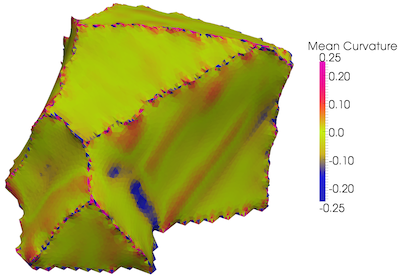

Find Feature Face Curvature {#featurefacecurvaturefilter}
=============

## Group (Subgroup) ##
Surface Meshing (Curvature)

## Description ##
This Filter calculates the _mean_ and _Gaussian_ curvature for each **Triangle** in a **Triangle Geometry** using the technique in [1]. The groups of **Triangles** over which to compute the curvatures is determines by the **Features** they are associated, deonoted by their _Face Labels_. The curvature information will be stored in a new **Edge Attribute Matrix**.

Principal Curvatures 1 and 2 are the &kappa;1 and &kappa;2 from [1] and are the eigenvalues from the Wiengarten matrix. The Principal Directions 1 and 2 are the eigenvectors from the solution to the least squares fit algorithm. The Mean Curvature is (&kappa;1 + &kappa;2)/2, while the Gaussian curvature is (&kappa;1 * &kappa;2).

-----

@image latex FeatureFaceCurvatureFilter.png "Curvature Coloring of a Feature" width=6in

-----

## Parameters ##
| Name | Type | Description |
|------|------| ----------- |
| Neighborhood Ring Count | Int | The size of the nieghborhood to use to calculate the curvature values |
| Compute Principal Direction Vectors | Bool | Whether to compute the principal direction vectors |
| Compute Gaussian Curvature | Bool | Whether to compute the Gaussian curvature values |
| Compute Mean Curvature | Bool | Whether to compute the mean curvature values |
| Use Face Normals for Curve Fitting | Bool | Whether to use the **Face** normals to improve the least squares fit |
| Edge Attribute Matrix Name | String | Created **Edge Attribute Matrix** name |

## Required Geometry ##
Triangle

## Required Arrays ##
| Type | Default Name | Type | Component Dimensions | Description |
|------|--------------|-------------|---------|-----|
| Face | FaceLabels | Int | (2) | Specifies which **Features** are on either side of each **Face** |
| Face | FeatureFaceIds | Int | (1) | Specifies to which **Feature** boundary each **Face** belongs |
| Face | FaceNormals | Double | (3) | Specifies the normal of each **Face** |
| Face | FaceCentroids | Double | (3) | Specifies the centroid of each **Face** |

## Created Arrays ##
| Type | Default Name | Type | Component Dimensions | Description |
|------|--------------|-------------|---------|-----|
| Edge | PrincipalCurvature1 | Double | (2) | First set eigenvalues of the Wiengarten matrix (&kappa;1). Only computed if _Compute Principal Direction Vectors_ is checked |
| Edge | PrincipalCurvature2 | Double | (2) | Second set eigenvalues of the Wiengarten matrix (&kappa;2). Only computed if _Compute Principal Direction Vectors_ is checked |
| Edge | PrincipalDirection1 | Double | (3) | First set of eigenvectors. Only computed if _Compute Principal Direction Vectors_ is checked |
| Edge | PrincipalDirection2 | Double | (3) | Second set of eigenvectors. Only computed if _Compute Principal Direction Vectors_ is checked |
| Edge | MeanCurvatures      | Double | (2) | Mean curvature values. Only computed if _Compute Mean Curvature_ is checked |
| Edge | GaussianCurvatures  | Double | (2) | Gaussian curvature values. Only computed if _Compute Gaussian Curvature_ is checked |

## References ##
[1] J. Goldfeather, V. Interrante, "A Novel Cubic-Order Algorithm for Approximating Principal Direction Vectors", ACM Transactions on Graphics 2004, 23(1), pp. 45-63.

## License & Copyright ##

Please see the description file distributed with this plugin.

## DREAM3D Mailing Lists ##

If you need more help with a filter, please consider asking your question on the DREAM3D Users mailing list:
https://groups.google.com/forum/?hl=en#!forum/dream3d-users

