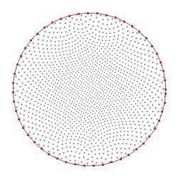
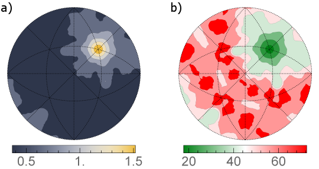

Find GBCD (Metric-based Approach) {#findgbcd_metricbased}
=============

## Group (Subgroup) ##
Surface Meshing (Surface Meshing)

## Description ##

This filter computes a section through the five-dimensional grain boundary distirbution for a fixed misorientation.
An example of such a section is shown in Fig. 1.
Differently than 'Find GBCD' filter which uses a method based on partition of the boundary space into bins,
this filter implements an alternative metric-based approach described in
[K.Glowinski, A.Morawiec, Analysis of experimental grain boundary distributions based on boundary-space metrics, Metall. Mater. Trans. A 45, 3189-3194 (2014)](http://link.springer.com/article/10.1007%2Fs11661-014-2325-y)

Metrics in the boundary space can be defined
in a number of ways, but it is essential that two
boundaries are close (distant) if they have similar
(different) geometric features, and that symmetrically
equivalent representations of boundaries are taken into
consideration. 
Formally, the boundary space is a Cartesian product of the misorientation and boundary-normal subspaces. 
For computational reasons and because of considerably different resolutions
in determinination of grain misorientation and boundary-plane parameters, it is convenient to use a
separate metric in each subspace. 
With separate metrics, the procedure for computing distribution values
for a selected misorientation has two stages.
First, boundary segments with misorientations located not farther
from the fixed misorientation than a limiting distance &rho;m 
are selected. In the second stage, the distribution is
probed at evenly distributed normal directions (see Fig. 2), and areas of boundaries whose normals deviate from a
given direction by less than &rho;p 
are summed. (The radii &rho;m and &rho;p should be tailored to resolution,
amount, and quality of data and set.)
Eventually, the obtained distribution is normalized in order to
express it in the conventional units, i.e., multiples of the random distribution. 

This filter also calculates statistical errors of the distributions using the formula
&epsilon; = ( *f* *n* *v* )1/2, where &epsilon;
is the relative error of the
distribution function at a given point, *f* is the value of the function at that point,
*n* stands for the number
of grain boundaries (**not** the number of mesh triangles)
in the considered network, and *v* denotes the volume restricted by &rho;m and &rho;p.
The errors can be calculated either as their absolute values, 
i.e., &epsilon; &times; *f* (Fig. 3a) or as relative errors, i.e., 100% &times; &epsilon; (Fig. 3b).
The latter are computed in a way that if the relative error exceeds 100%, it is rounded down to 100%.

![Fig. 1: Section for the 17.8 deg./[111] misorientation through the grain boundary distribution obtained using this filter for Small IN100 data set. Units are multiples of random distribution (MRDs).](FindGBCD_MetricBased_dist.png)

## Parameters ##
| Name | Type | Description |
|------|------|-------------|
| Phase of Interest | int32_t | Index of the **Ensemble** for which to compute the distribution |
| Fixed Misorientation | float (4x) | Axis-angle representation of the misorientation of interest |
| Limiting Distances (&rho;m and &rho;p) | Enumeration | Control parameters reflecting experimental resolutions |
| Number of Sampling Points | int32_t | The number of normal directions for which the distribution is probed (Fig. 2) |
| Include Some Points Below Equator | bool | These additional points may be critical for some plotting software to interpolate the function properly |
| Output File for Distribution | File Path | The output .dat file path (GMT format) |
| Output File for Distribution Errors  | File Path | The output .dat file path (GMT format) |
| Save Relative Errors | bool | If selected relative errors are computed instead of their absoulte values |

## Required Geometry ##
Image + Triangle

## Required Objects ##
| Kind | Default Name | Type | Component Dimensions | Description |
|-------|--------------|-------------|---------|-----|
| **Ensemble Attribute Array** | CrystalStructures | uint32_t | (1) | Enumeration representing the crystal structure for each **Ensemble** |
| **Feature Attribute Array** | AvgEulerAngles | float | (3) | Three angles defining the orientation of the **Feature** in Bunge convention (Z-X-Z) |
| **Feature Attribute Array** | Phases | int32_t | (1) | Specifies to which phase each **Feature** belongs |
| **Face Attribute Array** | FaceLabels | int32_t | (2) | Specifies which **Features** are on either side of each **Face** |
| **Face Attribute Array**  | FaceNormals | double | (3) | Specifies the normal of each **Face** |
| **Face Attribute Array**  | FaceAreas | double | (1) | Specifies the area of each **Face** |
| **Feature Face Attribute Array**  | FaceLabels | int32_t | (2) | Specifies to which phase each **Face Feature** belongs |

## License & Copyright ##

Please see the description file distributed with this plugin.

## DREAM3D Mailing Lists ##

If you need more help with a filter, please consider asking your question on the DREAM3D Users mailing list:
https://groups.google.com/forum/?hl=en#!forum/dream3d-users