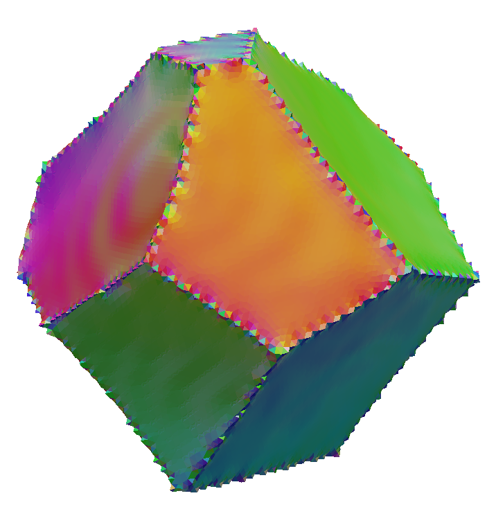

Generate IPF Colors (Face) {#generatefaceipfcoloring}
============

## Group (Subgroup) ##
Processing (Crystallography)

## Description ##
This **Filter** generates a pair of colors for each **Triangle** in a **Triangle Geometry** based on the inverse pole figure (IPF) color scheme for the present crystal structure. Each **Triangle** has 2 colors since any **Face** sits at a boundary between 2 **Features** for a well-connected set of **Features** that represent _grains_. The reference direction used for the IPF color generation is the _normal_ of the **Triangle**.

------------

@image latex GenerateFaceIPFColoring.png "Face IPF Coloring" width=6in

------------

## Parameters ##
None

## Required Geometry ##
Image + Triangle

## Required Objects ##

| Kind | Default Name | Type | Component Dimensions | Description |
|------|--------------|------|----------------------|-------------|
| **Face Attribute Array** | FaceLabels | int32_t | (2) | Specifies which **Features** are on either side of each **Face** |
| **Face Attribute Array**  | FaceNormals | double | (3) | Specifies the normal of each **Face** |
| **Feature Attribute Array** | AvgEulerAngles | float | (3) | Three angles defining the orientation of the **Feature** in Bunge convention (Z-X-Z) |
| **Feature Attribute Array** | Phases | int32_t | (1) | Specifies to which phase each **Feature** belongs |
| **Ensemble Attribute Array** | CrystalStructures | uint32_t | (1) | Enumeration representing the crystal structure for each **Ensemble** |

## Created Objects ##

| Kind | Default Name | Type | Component Dimensions | Description |
|------|--------------|------|----------------------|-------------|
| **Face Attribute Array** | IPFColors | uint8_t | (6) | A set of two RGB color schemes encoded as unsigned chars for each **Face** |

## License & Copyright ##

Please see the description file distributed with this **Plugin**

## DREAM.3D Mailing Lists ##

If you need more help with a **Filter**, please consider asking your question on the [DREAM.3D Users Google group!](https://groups.google.com/forum/?hl=en#!forum/dream3d-users)

