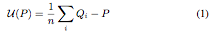

Laplacian Smoothing Filter {#laplaciansmoothing}
======

## Group (Subgroup) ##
SurfaceMesh

## Description ##
This filter implements a simple Laplcian based smoothing filter. Alexander Belyaev [2] has a concise explanation of the Laplacian Smoothing as follows:

---------------------------

Let us consider a triangulated surface and for any vertex P let us define the so-called umbrella-operator

@image latex Laplacian_Fig1.png " " width=6in

where summation is taken over all neighbors of P and wi are positive
weights. See Fig. 1 for the geometric idea behind the umbrella-operator.

@image latex Laplacian_Fig2.png " " width=3in

The weights, can be defined, for example, as the inverse distances between P and its neighbors. The simplest umbrella-operator is obtained if *w* i = 1 and the umbrella-operator has the form

@image latex Laplacian_Eq1.png " " width=3in

where n is the number of neighbors. The local update rule

@image latex Laplacian_Eq2.png " " width=3in

applied to every point of the triangulated surface is called Laplacian smoothing of the surface. Typically the factor &lambda; is a small positive number, and the process (2) is executed repeatedly. The Laplacian smoothing algorithm reduces the high frequency surface information and tends to flatten the surface. See Fig. 2 where Laplacian smoothing is applied to a triangulated model of a Noh mask.

   If &lambda; is too small, one needs more iterations for smoothing and the smoothing process becomes time-consuming. If &lambda; is not small enough, the smoothing process becomes unstable. 

---------------------------

 In the Laplacian algorithm the &lambda; term has a range of 0 &le; &lambda; &le; 1 and defines a relative distance that a node can move relative to the positions of the nodes neighbors. A &lambda; = 0 value will effectively stop those node types from any movement during the algorithm thus by allowing the user to set this value for specific types of nodes the user can arrest the shrinkage of the surface mesh during the smoothing process.

Currently if you lock the __Default Lambda__ value to Zero (0) the Triple Lines and Quad points will not be able to move because none of their neighbors can move. The user may want to consider allowing a small value of &lambda; for the default nodes which will allow some movement of the triple lines and/or Quad Points. This filter will create additional internal arrays in order to facilitate the calculations. These arrays are

- Float - Lambda values (Same size as Nodes array)
- 64 Bit Integer - Unique Edges Array
- Optinally 8 Bit Integer for Node Type (Same size as Nodes array)
- Integer for Number of Connections for each Node (Same size as Nodes Array)
- 64 Bit Float for Delta Values (3x size of Nodes array)

Due to these array allocations this filter can consume large amounts of memory if the starting mesh is large to start, ie, many nodes. 
The values for the __Node Type__ array can take one of the following values.

    namespace SurfaceMesh {
      namespace NodeType {
        const int8_t Unused = -1;
        const int8_t Default = 2;
        const int8_t TriplePoint = 3;
        const int8_t QuadPoint = 4;
        const int8_t SurfaceDefault = 12;
        const int8_t SurfaceTriplePoint = 13;
        const int8_t SurfaceQuadPoint = 14;
      }
    }

## Parameters ##

| Name | Type | Description |
|------|------|-------------|
| Iteration Steps | Integer | The number of iteration steps to perform. More steps cause more smoothing but will also cause the volume to shrink more. |
| Default Lambda | Double | The value of lambda to apply to general internal nodes that are not Triple lines, Quad Points or on the "surface" of the volume. |
| Surface Points Lambda | Double | The value of lambda to apply to nodes that lie on the outer surface of the volume |
| Triple Line Lambda | Double | Value of Lambda to apply to nodes designated as Triple Line nodes. |
| Quad Points Lambda | Double | Value of Lambda to apply to nodes designated as Quad points. |
| Surface Triple Line Lambda | Double | Value of Lambda for Triple Lines that lie on the outer surface of the volume |
| Surface Quad Points Lambda | Double | Value of Lambda for the Quad Points that lie on the outer surface of the volume. |

## Required DataContainers ##
SurfaceMesh - Valid Surface Mesh containing the shared vertex array and face list

## Required Arrays ##

| Type | Default Name | Description | Filters Known to Create Data |
|------|--------------|-------------|------------------------------|
| Vertex | SurfaceMeshNodeType | The array that describes the type of node. (See table in description above) | Quick Surface Mesh (SurfaceMeshing), M3C Surface Meshing (Slice at a Time) |

## Created Arrays ##
None

## Authors ##

## Bibliography ##

[1] _Feature, D. A. (1988), Laplacian smoothing and Delaunay triangulations. Commun. appl. numer. methods, 4: 709–712. doi: 10.1002/cnm.1630040603_

[2] _Alexander Belyaev. "Mesh Smoothing and Enhancing. Curvature Estimation",_

## License & Copyright ##

Please see the description file distributed with this plugin.

## DREAM3D Mailing Lists ##

If you need more help with a filter, please consider asking your question on the DREAM3D Users mailing list:
https://groups.google.com/forum/?hl=en#!forum/dream3d-users

