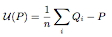
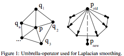
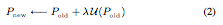

Laplacian Smoothing {#laplaciansmoothing}
============

## Group (Subgroup) ##
Surface Meshing (Smoothing)

## Description ##
This **Filter** applies Laplacian smoothing to a **Triangle Geometry** that represents a surface mesh. A. Belyaev [2] has a concise explanation of the Laplacian Smoothing as follows:

---------------------------

Let us consider a triangulated surface and for any vertex P let us define the so-called umbrella-operator

@image latex Laplacian_Fig1.png " " width=6in

where summation is taken over all neighbors of P and wi are positive
weights. See Fig. 1 for the geometric idea behind the umbrella-operator.

@image latex Laplacian_Fig2.png " " width=3in

The weights, can be defined, for example, as the inverse distances between P and its neighbors. The simplest umbrella-operator is obtained if *w* i = 1 and the umbrella-operator has the form

@image latex Laplacian_Eq1.png " " width=3in

where n is the number of neighbors. The local update rule

@image latex Laplacian_Eq2.png " " width=3in

applied to every point of the triangulated surface is called Laplacian smoothing of the surface. Typically the factor &lambda; is a small positive number, and the process (2) is executed repeatedly. The Laplacian smoothing algorithm reduces the high frequency surface information and tends to flatten the surface. See Fig. 2 where Laplacian smoothing is applied to a triangulated model of a Noh mask.

If &lambda; is too small, one needs more iterations for smoothing and the smoothing process becomes time-consuming. If &lambda; is not small enough, the smoothing process becomes unstable. 

---------------------------

In the Laplacian algorithm the &lambda; term has a range of 0 &le; &lambda; &le; 1 and defines a relative distance that a node can move relative to the positions of the nodes neighbors. A &lambda; = 0 value will effectively stop those node types from any movement during the algorithm thus by allowing the user to set this value for specific types of nodes the user can arrest the shrinkage of the surface mesh during the smoothing process.

### Taubin's Lambda-Mu Smoothing Algorithm ##

One of the options for the filter allows the user to apply Taubin's Lambda-Mu variation on Laplacian smoothing. This variation removes the shrinkage typically found with Laplacian smoothing by adding an additional step within each iteration where the negative of the (Lambda value \* Mu Factor) which effectively moves the points in the **opposite** direction from the initial movement. Because of this negative movement the number of iterations to achieve the same level of smoothing is greatly increased, on the order of 10x to 20x.

### Algorithm Usage and Memory Requirements ###

Currently, if you lock the _Default Lambda_ value to zero (0), the triple lines and quadruple points will not be able to move because none of their neighbors can move. The user may want to consider allowing a small value of &lambda; for the default nodes which will allow some movement of the triple lines and/or quadruple Points. 

This **Filter** will create additional internal arrays in order to facilitate the calculations. These arrays are

- Float - &lambda; values (same size as nodes array)
- 64 bit integer - unique edges array
- 8 bit integer for node type (same size as nodes array)
- Integer for number of connections for each node (same size as nodes array)
- 64 bit float for delta values (3x size of nodes array)

Due to these array allocations this **Filter** can consume large amounts of memory if the starting mesh has a large number of nodes. 
The values for the _Node Type_ array can take one of the following values.

    namespace SurfaceMesh {
      namespace NodeType {
        const int8_t Unused = -1;
        const int8_t Default = 2;
        const int8_t TriplePoint = 3;
        const int8_t QuadPoint = 4;
        const int8_t SurfaceDefault = 12;
        const int8_t SurfaceTriplePoint = 13;
        const int8_t SurfaceQuadPoint = 14;
      }
    }

For more information on surface meshing, visit the [tutorial](@ref tutorialsurfacemeshingtutorial).

## Parameters ##
| Name | Type | Description |
|------|------|-------------|
| Iteration Steps | int32_t | Number of iteration steps to perform. More steps causes more smoothing but will also cause the volume to shrink more. _Inreasing this number too high may cause collapse of points!_ |
| Default Lambda | float | Value of &lambda; to apply to general internal nodes that are not triple lines, quadruple points or on the surface of the volume |
| Use Taubin Smoothing | boolean | Use Taubin's Lambda-Mu algorithm. |
| Mu Factor | float | A value that is multipied by Lambda the result of which is the *mu* in Taubin's paper. The value should be a negative value. |
| Triple Line Lambda | float | Value of &lambda; to apply to nodes designated as triple line nodes. |
| Quadruple Points Lambda | float | Value of &lambda; to apply to nodes designated as quadruple points. |
| Outer Points Lambda | float | The value of &lambda; to apply to nodes that lie on the outer surface of the volume |
| Outer Triple Line Lambda | float | Value of &lambda; for triple lines that lie on the outer surface of the volume |
| Outer Quadruple Points Lambda | float | Value of &lambda; for the quadruple Points that lie on the outer surface of the volume. |

## Required Geometry ##
Triangle

## Required Objects ##

| Kind | Default Name | Type | Component Dimensions | Description |
|------|--------------|------|----------------------|-------------|
| **Vertex Attribute Array** | NodeTypes | int8_t | (1) | Specifies the type of node in the **Geometry** |
| **Face Attribute Array** | FaceLabels | int32_t | (2) | Specifies which **Features** are on either side of each **Face** |

## Created Objects ##
None

## References ##

[1] D. A. Feature, (1988) Laplacian smoothing and Delaunay triangulations. Commun. appl. numer. methods, 4: 709–712. doi: 10.1002/cnm.1630040603

[2] A. Belyaev, “Mesh smoothing and enhancing curvature estimation,” [http://www.mpi-inf.mpg.de/ ̃ag4-gm/handouts/06gm_surf3.pdf](http://www.mpi-inf.mpg.de/ ̃ag4-gm/handouts/06gm_surf3.pdf).

## License & Copyright ##

Please see the description file distributed with this **Plugin**

## DREAM.3D Mailing Lists ##

If you need more help with a **Filter**, please consider asking your question on the [DREAM.3D Users Google group!](https://groups.google.com/forum/?hl=en#!forum/dream3d-users)

