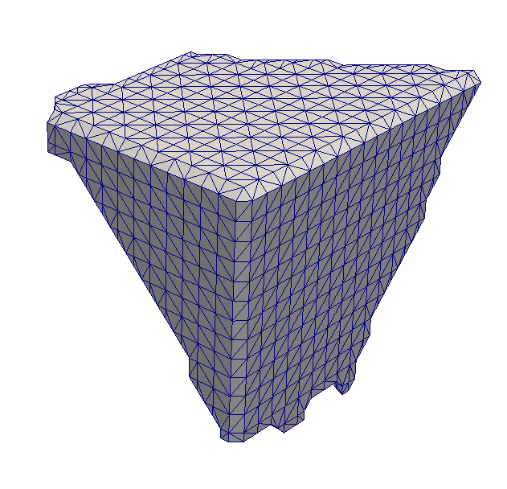

Multi-Material Marching Cubes (Slice at a Time) {#m3cslicebyslice}
======

## Group (Subgroup) ##
SurfaceMesh

## Description ##
This filter creates a surface mesh using a MultiMaterial Marching Cubes (M3C) algorithm as implemented at Carnegie-Mellon University by Dr. Sukbin Lee in the Materials Engineering department. The implementation is based on the Wu/Sullivan algorithm\*\*. Heavy modifications were performed by M. Groeber and M. Jackson for the DREAM3D project. The user is urged to read the original article by Wu/Sullivan in order to gain an understanding of how the algorithm works.

This version of the code meshes by looking at 2 slices of **Cells** at a time. The temporary data is then serialized out to disk and is then gathered into the complete shared vertex list and triangle list at the conclusion of the filter. The ramifications of this means that the working amount of RAM during the main part of the algorithm is much lower than the _Volume at a Time_ version of the M3C algorithm but does involve potentially a large amount of disk activity. At the conclusion of the filter the entire mesh is then read into memory which means that the user's computer must still have enough RAM to hold the final mesh in memory.
 
This version of the code does not have any restrictions on the wrapping of the **Cell** volume with a ghost layer of **Cells**. If the user's volume does have a ghost layer then those **Cells** should have a value that is __NEGATIVE__. This is very important as the algorithm that determines if a layer needs to be added looks specifically for negative values along the outside of the volume. __Other Considerations__ If you have created your **Cell** volume outside of DREAM3D and have imported it into DREAM3D then the user should take note that **Feature**/regions with an ID=0 are a special case inside of DREAM3D therefor the user should start their **Feature** numbering from 1 and be contiguous in numbers to the maximum number of **Features**. An effort is made to renumber **Cells** with a value of Zero (0) to Max + 1 during the meshing and then the **Cell** array is reset back to its pre-surface meshing input.
 
The values for the __Node Type__ array can take one of the following values.

    namespace SurfaceMesh {
      namespace NodeType {
        const int8_t Unused = -1;
        const int8_t Default = 2;
        const int8_t TriplePoint = 3;
        const int8_t QuadPoint = 4;
        const int8_t SurfaceDefault = 12;
        const int8_t SurfaceTriplePoint = 13;
        const int8_t SurfaceQuadPoint = 14;
      }
    }

---------------

@image latex M3CSurfaceMeshOutput.png "Example output showing a single grain on the edge of a box. Note the beveled edge of the box." width=3in

---------------

## Parameters ##

| Name | Type |
|------|------|
| Delete Temp Files | Boolean: Should the temporary files that are generated be deleted at the end of the filter. This is mostly for debugging. |

## Required DataContainers ##
Voxel
SurfaceMesh - This will create the Topology (Vertices and Triangles) of the surface mesh over writing anything that is currently in the SurfaceMeshDataContainer

## Required Objects ##

| Type | Default Name | Description | Comment | Filters Known to Create Data |
|------|--------------|-------------|---------|-----|
| Cell (Voxel) | GrainIds | Ids (ints) that specify to which **Feature** each **Cell** belongs. | Values should be present from segmentation of experimental data or synthetic generation and cannot be determined by this filter. Not having these values will result in the filter to fail/not execute. | Segment Features (Misorientation, C-Axis Misorientation, Scalar) (Reconstruction), Read Dx File (IO), Read Ph File (IO), Pack Primary Phases (SyntheticBuilding), Insert Precipitate Phases (SyntheticBuilding), Establish Matrix Phase (SyntheticBuilding) |

## Created Objects ##

| Type | Default Name | Comment |
|------|--------------|---------|
| Vertex Array | SurfaceMeshNodes | The shared list of nodes that make up the mesh |
| Triangle Array | SurfaceMeshTriangles | The List of triangles in the Surface Mesh |
| Vertex | SurfaceMeshNodeType | N x 1 Col of unsigned char |
| Face   | SurfaceMeshFaceLabels | N x 2 Col of signed integer |

## Authors ##

\*\*
## Bibliography ##
Ziji Wu, John M. Sullivan Jr, 2003, "Multiple material marching cubes algorithm". International Journal for Numerical Methods in Engineering. 07/2003; 58(2):189 - 207. DOI:10.1002/nme.775 pp.189 - 207

**ABSTRACT**

_The accurate reconstruction of three-dimensional (3D) boundary surfaces from two-dimensional (2D) medical images is a crucial procedure in most applications of computational biomedical engineering. This paper addresses an innovative system that efficiently reconstructs accurate, multiple-material, 3D surface meshes from 2D medical images. It is based on an enhanced marching cubes algorithm, the multi-material marching cubes algorithm (M3C), which extracts boundary surfaces between different materials within one sweep of the image stack in an integrated manner. The continuity and integrity of the surfaces are ensured with this robust algorithm. Surface adjustment algorithms were also revised to adapt to the multiple-material nature of the system. Copyright © 2003 John Wiley & Sons, Ltd._

## License & Copyright ##

Please see the description file distributed with this **Plugin**

## DREAM.3D Mailing Lists ##

If you need more help with a **Filter**, please consider asking your question on the [DREAM.3D Users Google group!](https://groups.google.com/forum/?hl=en#!forum/dream3d-users)

