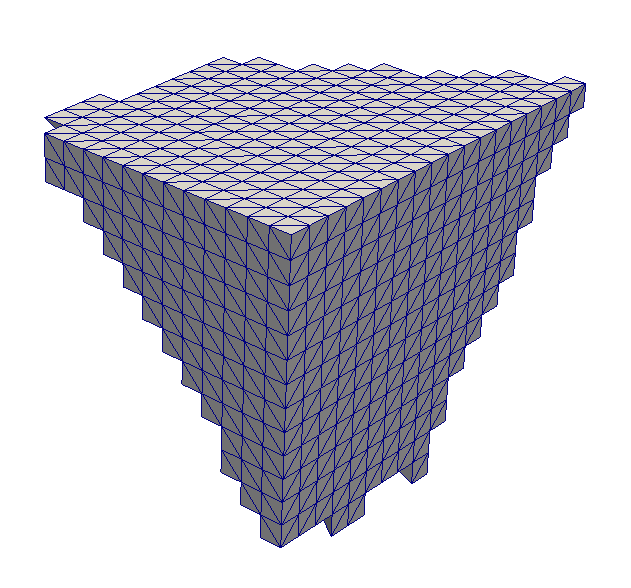

Quick Surface Mesh {#quicksurfacemesh}
============

## Group (Subgroup) ##
Surface Meshing (Generation)

## Description ##
This **Filter** generates a **Triangle Geometry** from an **Image Geometry** that represents a surface mesh of the present **Features**. The algorithm proceeds by creating a pair of **Triangles** for each face of the **Cell** where the neighboring **Cell** have a different **Feature** Id value. The meshing operation is extremely quick but can result in a surface mesh that is very "stair stepped". The user is encouraged to use a [smoothing operation](@ref laplaciansmoothing) to reduce this "blockiness".

The user may choose any number of **Cell Attribute Arrays** to transfer to the created **Triangle Geometry**. The **Faces** will gain the values of the **Cells** from which they were created.  Currently, the **Filter** disallows the transferring of data that has a *multi-dimensional* component dimensions vector.  For example, scalar values and vector values are allowed to be transferred, but N x M matrices cannot currently be transferred. 

For more information on surface meshing, visit the [tutorial](@ref tutorialsurfacemeshingtutorial).

---------------

@image latex QuickSurfaceMeshOutput.png "Example Quick Mesh Output" width=6in

---------------

## Parameters ##
None

## Required Geometry ##
Image

## Required Objects ##
| Kind | Default Name | Type | Component Dimensions | Description |
|------|--------------|-------------|---------|-----|
| **Cell Attribute Array** | FeatureIds | int32_t | (1) | Specifies to which **Feature** each **Cell** belongs |
| Any **Cell Attribute Array** |  None | Any | Any | Specifies which **Cell Attribute Arrays** to transfer to the created **Triangle Geometry** |

## Created Objects ##
| Kind | Default Name | Type | Component Dimensions | Description |
|------|--------------|-------------|---------|-----|
| **Data Container** | TriangleDataContainer | N/A | N/A | Created **Data Container** name with a **Triangle Geometry** |
| **Attribute Matrix** | VertexData | Vertex | N/A | Created **Vertex Attribute Matrix** name  |
| **Vertex Attribute Array** | NodeTypes | int8_t | (1) | Specifies the type of node in the **Geometry** |
| **Attribute Matrix** | FaceData | Face | N/A | Created **Face Attribute Matrix** name  |
| **Face Attribute Array** | FaceLabels | int32_t | (2) | Specifies which **Features** are on either side of each **Face** |
| Any **Face Attribute Array** | None | Any | Any | The set of transferred **Cell Attribute Arrays** |

## License & Copyright ##

Please see the description file distributed with this **Plugin**

## DREAM.3D Mailing Lists ##

If you need more help with a **Filter**, please consider asking your question on the [DREAM.3D Users Google group!](https://groups.google.com/forum/?hl=en#!forum/dream3d-users)

