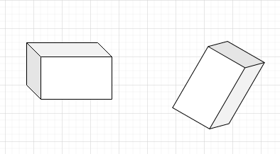
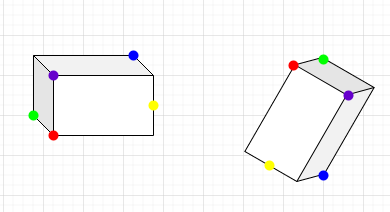
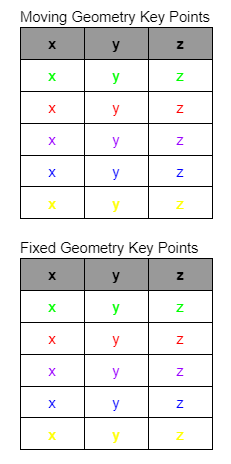

# RigidPointCloudTransform #

## Group (Subgroup) ##

SurfaceMeshing (SurfaceMeshing)

## Description ##

This **Filter** aligns one rigid geometry on top of another based on parameter input.

## Parameters ##

| Name | Type | Description |
|------|------|------|
| GenerationCount | Integer | The number of times algorithm is run to hone result |
| MovingGeometry | Data Container Selection | The geometry to be aligned (will be modified implicitly) |
| MovingKeyPoints | Dynamic Table | Table of key points from **MovingGeometry** |
| FixedKeyPoints | Dynamic Table | Corresponding table of key points from the geometry to align **MovingGeometry** with |

## Required Geometry ##

Igeometry2D, Igeometry3D, VertexGeom, or EdgeGeom

## Created Objects ##

| Kind | Default Name | Type | Component Dimensions | Description |
|------|--------------|-------------|---------|-----|
| **Attribute Matrix** | Transformation Matrix | cell | 1 | Affine Transform Matrix Wrapper |
| **Element/Feature/Ensemble/etc. Attribute Array** | 4x4 Affine Transform Matrix | float | (4)/(4) | Calculated 4x4 Affine Transform Matrix |

## License & Copyright ##

Please see the description file distributed with this plugin.

## DREAM3D Mailing Lists ##

If you need more help with a filter, please consider asking your question on the DREAM3D Users mailing list:
https://groups.google.com/forum/?hl=en#!forum/dream3d-users

## In-depth breakdown ##
Parameters: 
Generations To Run: [Minimum 10, Maximum 100] This parameter controls how many times the algorithm is run. It should be considered here that each generation contains a nested iterative run count of 1000, thus each generation can be viewed as adding 1000 more iterations.
Geometry To Align: [Must be a child of Vertex Geometry] This is the geometry whose points are going to be aligned with the Geometry whose points are contained in Key Points from Fixed
Key Points from Moving: [order matters] These are an ordered set of non-coplanar points (x, y, z) from the geometry to be aligned. The index of these points should correspond to their counterpart Key Points from Fixed. 
Key Points from Fixed: [order matters] These are an ordered set of non-coplanar points (x, y, z) from the geometry that Geometry To Align will be aligned onto. The index of these points should correspond to their counterpart Key Points from Fixed.

Notes on Filter Input:

To begin, let us expand on how to select points for the filter. As previously mentioned, the points should be non-coplanar, in simple terms a 3D shape should not only have points from one of its faces selected in order to account for the depth of an object. Likewise, points should roughly correspond to one another, to clarify the points do not have to be the exact same place on the object, but the closer they are, the more accurate alignment will likely be. Lastly, this filter was designed to align rigid geometries, thus the more distorted scaling or object shape is the less likely this filter will be to properly align as it doesn’t account for scaling. To illustrate how points should be selected look to the following:

In this example, we will be examining the above geometries. Point selection should look like this:

Here we can see that the points selected are all around the object to give the best chance at alignment. Picking vertices can make it easier to find corresponding points, but edges can also be used so long as they are in roughly the same spot as demonstrated by the yellow point. The next important selection is the moving geometry. Continuing with our above example, if you elect the one on the left to be the fixed geometry, then the one on the right will get an affine transformation matrix applied to it to move the points so it overlays the fixed geometry. 

It is important to note here that you need to make sure the points entered into the moving geometry key points table are indeed from the Geometry To Align, as this is a simple mistake that can derail the filter output.

Once they have been selected they should be entered into the table like so:

The order of points on an object do not matter [i.e you can enter a vertex point - edge point - vertex point] so long as their counterparts are entered in the same order, which is what the colors attempt to illustrate in the above example.

Notes on Filter Output:
Most notably, this filter doesn’t align them perfectly, so it’s highly recommended to run Iterative Closest Point (ICP) on the data afterwards for a more complete overlay of objects.
This filter does implicitly update the points of the moving geometry with the affine transformation matrix. This filter does store the calculated 4x4 affine transform matrix in the data structure underneath the moving geometry object’s hierarchy. On this topic, scaling has not been implemented so the bottom-most row of this matrix should always be [0 0 0 1].
Algorithm Explanation:
In this section, I will be giving a very brief overview of the algorithm where I will provide further reading for a curious reader where applicable. Structure for this section will be based on the execution order of said algorithm. I will be excluding the math definitions and proofs for each section, but many of the linked resources have the full definition and assumptions.

Execution Begin

Step 1: 
Assemble triangular planes from the input points for both moving key points and fixed key points.

Fairly straightforward, collections of 3 points are selected and stored in matrices of size 3x3 from those provided in the key points tables. To keep processing time down in later stages, only N-2 planes are defined, where N is the number of points given. This could be more accurate if all permutations are taken, but this set tends to be enough.

Step 2: 
Find the centroids of the triangular planes for each set of points respectively.

Step 3:
Establish correlation structure for points and an array object for holding working calculation variables in their complex (num + num*i) form.

The correlation structure holds the index of like points from the centroid sets from moving and static (fixed) geometries. The array in our case stores variables dx, dy, dz, phi1, PHI, phi2 in that order.

➥ Enter Generations Loop 

Step 1a: 
Call Least Squares Fit function modeled around a modified version of Least Squares Rigid Motion using SVD: https://igl.ethz.ch/projects/ARAP/svd_rot.pdf and Gradient descent models: https://towardsdatascience.com/understanding-the-mathematics-behind-gradient-descent-dde5dc9be06e 

➥ Enter LeastSqauresFit

Step 1b: 
Calculate loss between attempted alignment of moving geometry and static geometry.

To do this we:
Form the affine transformation matrix using calculation variable array [ZXZ convention used for rotation matrix]: https://onlinelibrary.wiley.com/doi/epdf/10.1002/cmr.a.21242
Apply affine transformation matrix to moving centroids set
Pass to centroid sets to loss function
Loss function:
The goal of this function is to iterate through each row (x, y, z coordinate) and find the difference between the static and attempted alignment coord that correspond according to the correlation matrix. This difference is then squared and summed by row to a singular resulting column, which is then summed again to reach a singular complex float.

Step 2b: 
Calculate gradient descent array of sets and use it to form a test calculation variable array.

Again I encourage you to look at Understanding Gradient Descent Algorithm for further understanding of this step.

Step 3b:
Traverse a selection of steps and apply them to the test calculation variable array.

In our case the steps used are -0.11, -0.011, -0.0011, 0.001, 0.01, 0.1, 0.5, 1.0, 2.0, 10.0. The goal of this is to rock our array back and forth along the number line to hone in results

➥ Enter Step Loop

Step 1c: 
Apply the step from above set to each value of the test calculation variable array.

Step 2c:
Run loss function on the resulting calculation variable array.

Step 3c:
If the resulting loss is less than the current run’s best working loss, then update the best working loss and store as the working best.

Step 4c:
Loop until you run out of steps.

⤦ Return to LeastSqauresFit

Step 4b:
If working loss is less than best loss, update best loss and and best calculation values array with their working versions. Else generate new guesses for working calculation values array. 

Step 5b:
Loop 1000 times to (hopefully) find the new best calculation values array and return it after updating euler angles properly.

⤦ Return to Generations Loop

Step 2a:
Find new moving best centroids set with best calculation values.
Step 3a:
Update correlation structure with possible new match of indices.

Iterate through each pair of corresponding points and check distance between the two. If the distance (after accounting for error) is more accurate than existing correlation then create a new correlation structure and search for the lowest error of each point. If no new correlation is found, reset to no change in correlation structure.

Step 4a:
Loop until user defined generationCount is met

⤦ Return to parent function

Step 4:
Store the affine transform matrix found in the generations loop in the data structure

Step 5: 
Iterate through the moving geometry’s vertex list and apply affine transform matrix

Execution end
