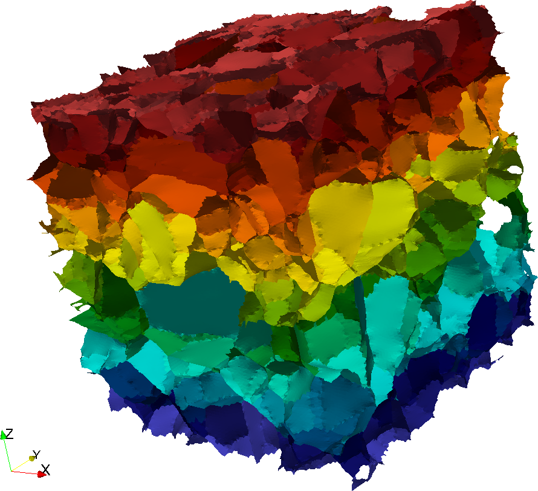

Generate Triangle Face Ids {#sharedfeaturefacefilter}
============

## Group (Subgroup) ##
Surface Meshing (Connectivity/Arrangement)

## Description ##
This **Filter** assigns a unique Id to each **Triangle** in a **Triangle Geometry** that represents the _unique boundary_ on which that **Triangle** resides. For example, if there were only two **Features** that shared one boundary, then the **Triangles** on that boundary would be labeled with a single unique Id. This procedure creates _unique groups_ of **Triangles**, which themselves are a set of **Features**. Thus, this **Filter** also creates a **Feature Attribute Matrux** for this new set of **Features**, and creates **Attribute Arrays** for their Ids and number of **Triangles**.

---------------

@image latex featureFaceIds.png "Example Surface Mesh Coloring By Feature Face Id" width=6in

---------------

## Parameters ##
None

## Required Geometry ##
Triangle

## Required Objects ##

| Kind | Default Name | Type | Component Dimensions | Description |
|------|--------------|------|----------------------|-------------|
| **Face Attribute Array** | FaceLabels | int32_t | (2) | Specifies which **Features** are on either side of each **Face** |

## Created Objects ##

| Kind | Default Name | Type | Component Dimensions | Description |
|------|--------------|------|----------------------|-------------|
| **Face Attribute Array** | FeatureFaceId | int32_t | (1) | Specifies to which **Feature** each **Face** belongs |
| **Attribute Matrix** | FaceFeatureData | Face Feature | N/A | Created **Feature Attribute Matrix** name  |
| **Feature Attribute Array** | FaceLabels | int32_t | (2) | Specifies which _original_ **Features** are on either side of each _new_ **Feature** |
| **Feature Attribute Array** | NumTriangles | int32_t | (1) | Number of **Triangles** in each **Feature** |

## License & Copyright ##

Please see the description file distributed with this **Plugin**

## DREAM.3D Mailing Lists ##

If you need more help with a **Filter**, please consider asking your question on the [DREAM.3D Users Google group!](https://groups.google.com/forum/?hl=en#!forum/dream3d-users)

