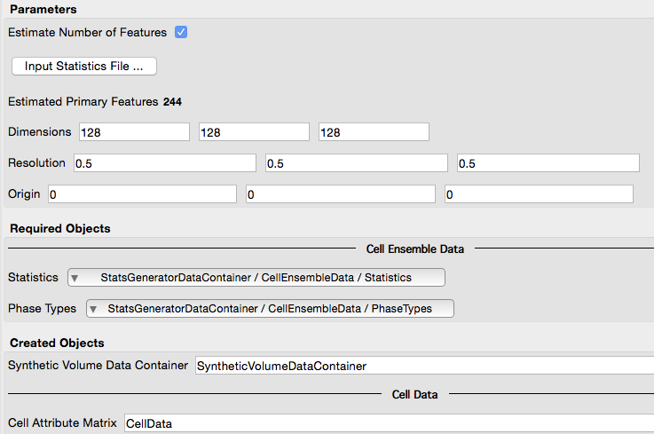
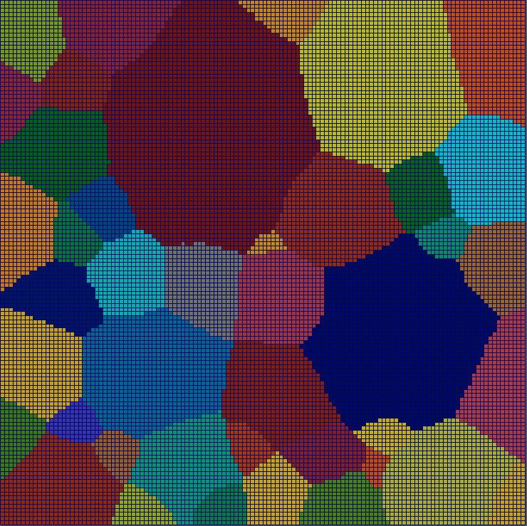
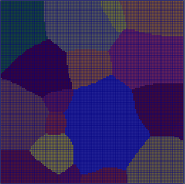
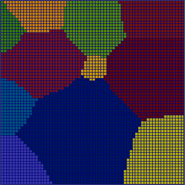
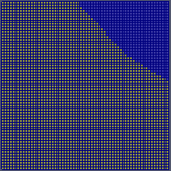

Initialize Synthetic Volume {#initializesyntheticvolume}
=============

## Group (Subgroup) ##
Synthetic Building (Packing)

## Description ##
This **Filter** creates an _empty_ volume composed of an **Image Geometry** to serve as a base for inserting **Features** to create a synthetic microstructure. The **Filter** wil also create a **Data Container** in which to hold the generated **Image Geometry** and a corresponding **Cell Attribute Matrix**. The user sets the _dimensions_, _origin_, and _resolution_ of the **Image Geometry**. The _dimensons_ are the X, Y, and Z extents of the **Image Geometry** in number of **Cells**. The _resolution_ represents the _edge length_ of a given **Cell**, and therefore has units of _length_. The _origin_ is the real space location of the (0, 0, 0) coordinate. When selecting the _Estimate Number of Features_ option, the **Filter** will guess at how many **Features** may end up being inserted into the volume based on the _Statistics_ defined in a .dream3d file. Note that this estimation is only valid if the file chosen is the _same file_ used as the source of the chosen _Statistics_ array.

For more information on synthetic building, visit the [tutorial](@ref tutorialsyntheticsingle).

### User Interface ###

@image latex InitializeSyntheticVolume.png "User Interface" width=6in

### Relationship between Dimensions and Resolution ###

It can be confusing to keep straight the relationship between the **Dimensions** and **Resolution** and how changes will
effect the number of features that would be generated. The table below illustrates the relationship via images from four
synthetic generation runs where each run only the dimension or resolution was changed. The inputs were either 128 or 64
voxels on a side and either 0.5 or 0.25 resolution. The units are arbitrary length units. Examining the images in the table will allow the user to better understand the relationship.

|                    | Resolution (0.5^3) | Resolution (0.25^3) |
|--------------------|--------------------|---------------------|
| **Dimensions (128^3)** |   |   |
| **Dimensions (64^3)**  |    |    |

## Parameters ##
| Name | Type | Description |
|------|------| ----------- |
| Estimate Number of Features | bool | Whether to estimate the number of **Features** in the _primary phase_ that may be inserted into the volume |
| Input Statistics File | File Path | The input .dream3d statistics file. Only needed if _Estimate Number of Features_ is checked |
| Dimensions | int32_t (3x) | The (X, Y, Z) extents of the **Image Geometry** in voxels |
| Resolution | float (3x) | The (dx, dy, dz) resolution of the **Image Geometry** in units of length |
| Origin | float (3x) | The location of the (0, 0, 0) coordinate |

## Required Geometry ##
Not Applicable

## Required Objects ##

| Kind | Default Name | Type | Component Dimensions | Description |
|------|--------------|------|----------------------|-------------|
| **Ensemble Attribute Array** | Statistics | Statistics Object | (1) | Statistics objects (depending on *Phase Type*) that store fits to descriptors such as size distribution, shape distribution, neighbor distribution, ODF, MDF, etc. |
| **Ensemble Attribute Array** | PhaseTypes | uint32_t | (1) | Enumeration specifying the phase type of each **Ensemble** |

## Created Objects ##

| Kind | Default Name | Type | Component Dimensions | Description |
|------|--------------|------|----------------------|-------------|
| **Data Container** | SyntheticVolumeDataContainer | N/A | N/A | Created synthetic volume **Data Container** name with an **Image Geometry** |
| **Attribute Matrix** | CellData | Cell | N/A | Created **Cell Attribute Matrix** name |

## License & Copyright ##

Please see the description file distributed with this **Plugin**

## DREAM.3D Mailing Lists ##

If you need more help with a **Filter**, please consider asking your question on the [DREAM.3D Users Google group!](https://groups.google.com/forum/?hl=en#!forum/dream3d-users)

