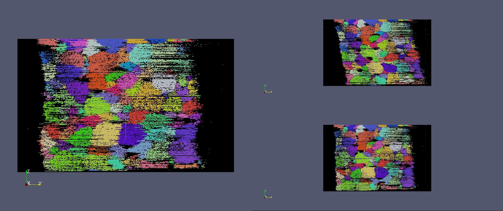

RemoveJitter {#removejitter}
=====

## Group (Subgroup) ##
UCSB (UCSB)

## Description ##
Computes alignment as with align by misorientation. After all shifts have been found a line is fit and any 'shear' removed (~first order 'background subtraction' on alignment)

## Parameters ##
| Name             | Type |
|------------------|------|
| Field Array Name | String |

## Required Arrays ##

| Type | Default Array Name | Description | Comment |
|------|--------------------|-------------|---------|
| Int  | SomeName           | ....        | other   |

## Created Arrays ##

None

## Authors ##

**Copyright** 2014 Will Lenthe (UCSB)

**Contact Info** willlenthe@gmail.com

**Version** 1.0.0

**License**  See the License.txt file that came with DREAM3D.

See a bug? Does this documentation need updated with a citation? Send comments, corrections and additions to [The DREAM3D development team](mailto:dream3d@bluequartz.net?subject=Documentation%20Correction)
