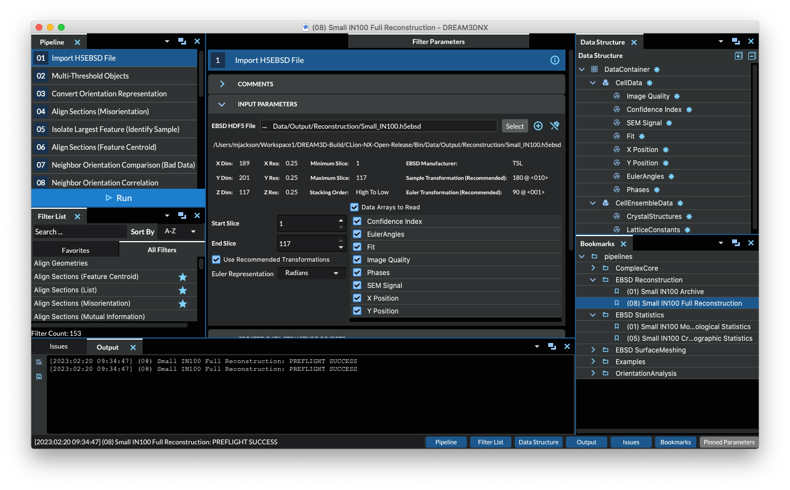
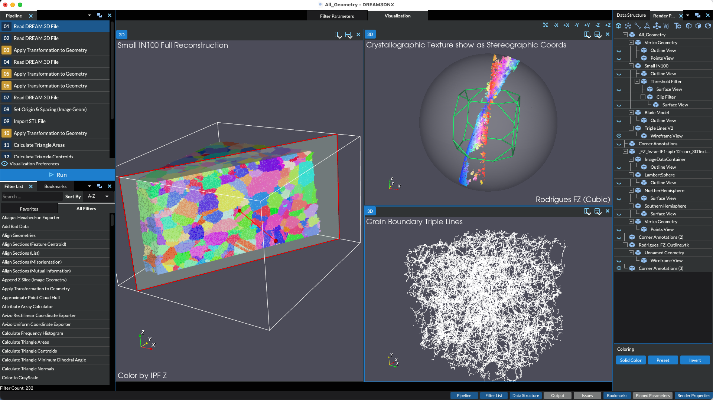

# DREAM.3D NX: The Next Generation of DREAM.3D Alpha Release

BlueQuartz Software has officially released the next version of DREAM.3D, **DREAM.3D NX**. This version is completely rewritten from the ground up using modern C++ and Python coding standards, contains complete filter unit testing coverage and a fresh brand new interface that is still familiar to previous users. You can check out the full release notes and download your trial version at [http://www.dream3d.io](http://www.dream3d.io). There are intended to be two versions, a free version and a paid for version with the major differentiation being the paid for version has built in visualization. Please contact **dream3d@bluequartz.net** for more information to obtain a license to the full verison of DREAM.3D NX.

## DREAM.3D NX Screenshots (Version 7.0.0 Alpha-1)

| Version | |
|--|--|
| Free |  |
| Commercial |  |